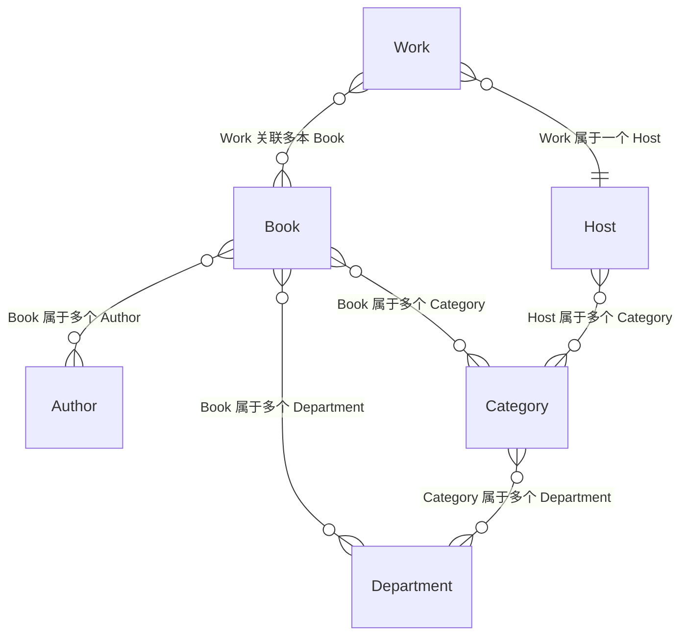
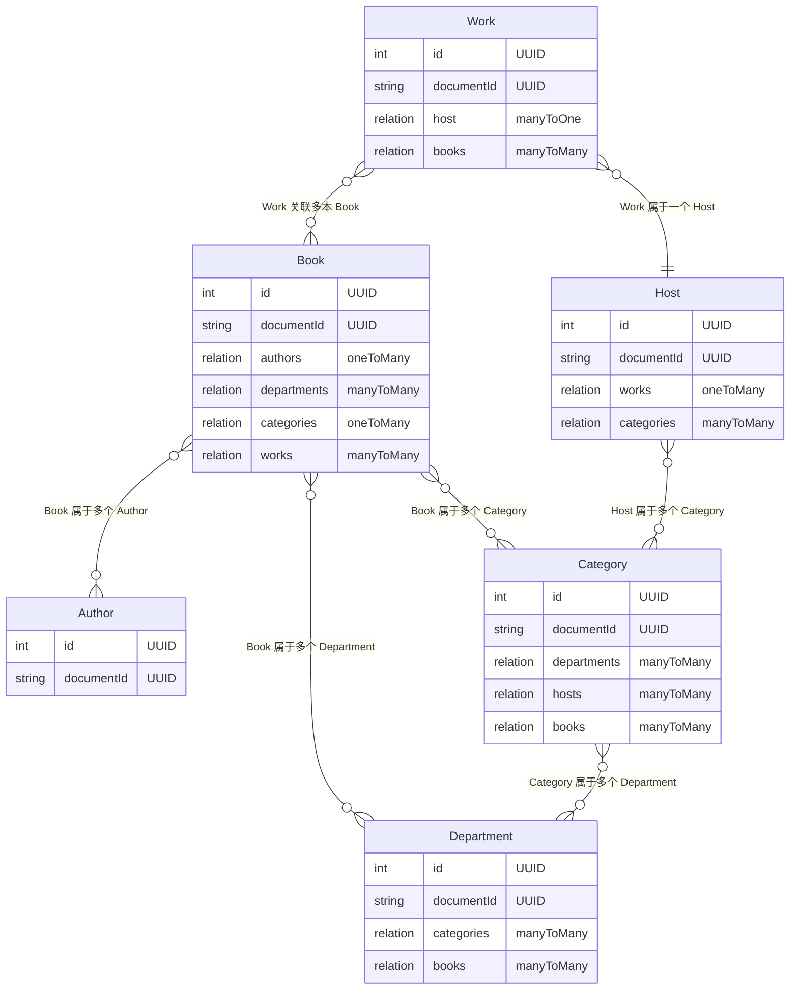

## 内容域

### ER 模型设计

- Work：作品的基本信息和与 host、books 的关联信息。
- Host：Host 的基本信息和与 works、categories 的关联信息。
- Book：书籍的基本信息和与 authors、departments、categories、works 的关联信息。
- Author：作者的基本信息。
- Department：大类的基本信息和与 categories、books 的关联信息。
- Category：小类的基本信息和与 departments、books、hosts 的关联信息。

#### 概览版



#### 详细版



### Schema 设计

#### Work

```json
{
  "kind": "collectionType",
  "collectionName": "works",
  "info": {
    "singularName": "work",
    "pluralName": "works",
    "displayName": "Work",
    "description": ""
  },
  "options": {
    "draftAndPublish": true
  },
  "pluginOptions": {},
  "attributes": {
    "title": {
      "type": "string",
      "required": true
    },
    "type": {
      "type": "enumeration",
      "enum": ["podcast"],
      "required": true,
      "default": "podcast"
    },
    "slug": {
      "type": "uid",
      "targetField": "title"
    },
    "subtitle": {
      "type": "string"
    },
    "description": {
      "type": "text"
    },
    "cover": {
      "type": "media",
      "multiple": false,
      "required": false,
      "allowedTypes": ["images"]
    },
    "audio": {
      "type": "media",
      "multiple": false,
      "required": false,
      "allowedTypes": ["audios"]
    },
    "audioDuration": {
      "type": "integer",
      "min": 0
    },
    "speakers": {
      "type": "string"
    },
    "host": {
      "type": "relation",
      "relation": "manyToOne",
      "target": "api::host.host",
      "inversedBy": "works"
    },
    "books": {
      "type": "relation",
      "relation": "manyToMany",
      "target": "api::book.book",
      "inversedBy": "works"
    },
    "chapters": {
      "type": "component",
      "repeatable": true,
      "component": "shared.chapter"
    },
    "chaptersFile": {
      "type": "media",
      "multiple": false,
      "required": false,
      "allowedTypes": ["files"]
    },
    "colors": {
      "type": "json"
    },
    "blocks": {
      "type": "dynamiczone",
      "components": ["shared.slider", "shared.rich-text", "shared.quote", "shared.media"]
    },
    "background": {
      "type": "media",
      "multiple": false,
      "required": false,
      "allowedTypes": ["images"]
    },
    "likeCount": {
      "type": "integer",
      "default": 0,
      "unique": false,
      "min": 0
    },
    "collectCount": {
      "type": "integer",
      "min": 0,
      "default": 0
    }
  }
}
```

#### Host

```json
{
  "kind": "collectionType",
  "collectionName": "hosts",
  "info": {
    "singularName": "host",
    "pluralName": "hosts",
    "displayName": "Host",
    "description": ""
  },
  "options": {
    "draftAndPublish": true
  },
  "pluginOptions": {},
  "attributes": {
    "name": {
      "type": "string",
      "required": true
    },
    "avatar": {
      "type": "media",
      "multiple": false,
      "required": true,
      "allowedTypes": ["images"]
    },
    "slug": {
      "type": "uid",
      "targetField": "name",
      "required": true
    },
    "description": {
      "type": "text"
    },
    "works": {
      "type": "relation",
      "relation": "oneToMany",
      "target": "api::work.work",
      "mappedBy": "host"
    },
    "categories": {
      "type": "relation",
      "relation": "manyToMany",
      "target": "api::category.category",
      "inversedBy": "hosts"
    },
    "followCount": {
      "type": "integer",
      "min": 0,
      "default": 0
    },
    "likeCount": {
      "type": "integer",
      "default": 0,
      "min": 0
    }
  }
}
```

#### Book

```json
{
  "kind": "collectionType",
  "collectionName": "books",
  "info": {
    "singularName": "book",
    "pluralName": "books",
    "displayName": "Book",
    "description": ""
  },
  "options": {
    "draftAndPublish": true
  },
  "pluginOptions": {},
  "attributes": {
    "title": {
      "type": "string"
    },
    "slug": {
      "type": "string",
      "unique": true,
      "targetField": "title"
    },
    "authors": {
      "type": "relation",
      "relation": "oneToMany",
      "target": "api::author.author"
    },
    "subtitle": {
      "pluginOptions": {},
      "type": "string"
    },
    "cover": {
      "type": "media",
      "multiple": false,
      "required": false,
      "allowedTypes": ["images"],
      "pluginOptions": {}
    },
    "description": {
      "pluginOptions": {},
      "type": "richtext"
    },
    "departments": {
      "type": "relation",
      "relation": "manyToMany",
      "target": "api::department.department",
      "mappedBy": "books"
    },
    "categories": {
      "type": "relation",
      "relation": "manyToMany",
      "target": "api::category.category",
      "inversedBy": "books"
    },
    "works": {
      "type": "relation",
      "relation": "manyToMany",
      "target": "api::work.work",
      "mappedBy": "books"
    },
    "colors": {
      "type": "json"
    },
    "collectCount": {
      "type": "integer",
      "min": 0,
      "default": 0
    }
  }
}
```

#### Author

```json
{
  "kind": "collectionType",
  "collectionName": "authors",
  "info": {
    "singularName": "author",
    "pluralName": "authors",
    "displayName": "Author",
    "description": "Create authors for your content"
  },
  "options": {
    "draftAndPublish": false
  },
  "pluginOptions": {},
  "attributes": {
    "name": {
      "type": "string",
      "required": true
    },
    "avatar": {
      "type": "media",
      "multiple": false,
      "required": false,
      "allowedTypes": ["images", "files"]
    },
    "description": {
      "type": "text"
    }
  }
}
```

#### Department

```json
{
  "kind": "collectionType",
  "collectionName": "departments",
  "info": {
    "singularName": "department",
    "pluralName": "departments",
    "displayName": "Department",
    "description": ""
  },
  "options": {
    "draftAndPublish": true
  },
  "attributes": {
    "name": {
      "type": "string",
      "required": true
    },
    "slug": {
      "type": "uid",
      "targetField": "name"
    },
    "description": {
      "type": "text"
    },
    "categories": {
      "type": "relation",
      "relation": "manyToMany",
      "target": "api::category.category",
      "inversedBy": "departments"
    },
    "cover": {
      "type": "media",
      "multiple": false,
      "required": false,
      "allowedTypes": ["images"]
    },
    "sort": {
      "type": "integer",
      "default": 0,
      "min": 0
    },
    "books": {
      "type": "relation",
      "relation": "manyToMany",
      "target": "api::book.book",
      "inversedBy": "departments"
    }
  }
}
```

#### Category

```json
{
  "kind": "collectionType",
  "collectionName": "categories",
  "info": {
    "singularName": "category",
    "pluralName": "categories",
    "displayName": "Category",
    "description": "Organize your content into categories"
  },
  "options": {
    "draftAndPublish": false
  },
  "pluginOptions": {},
  "attributes": {
    "name": {
      "type": "string"
    },
    "slug": {
      "type": "uid",
      "targetField": "name"
    },
    "description": {
      "type": "text"
    },
    "departments": {
      "type": "relation",
      "relation": "manyToMany",
      "target": "api::department.department",
      "mappedBy": "categories"
    },
    "hosts": {
      "type": "relation",
      "relation": "manyToMany",
      "target": "api::host.host",
      "mappedBy": "categories"
    },
    "books": {
      "type": "relation",
      "relation": "manyToMany",
      "target": "api::book.book",
      "inversedBy": "categories"
    }
  }
}
```

### API 设计

详见 APIfox 文档
