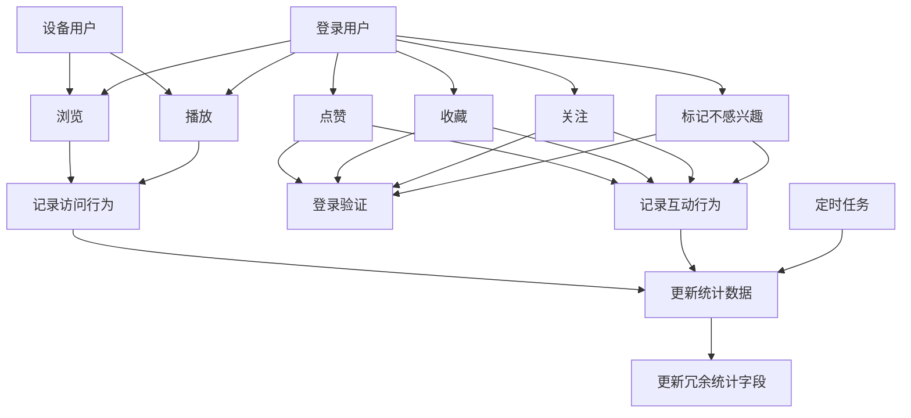
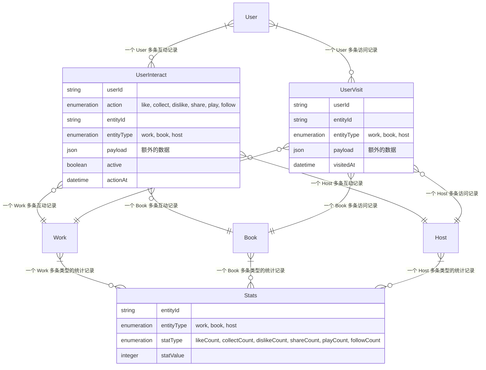

## 互动域

### 用例图



### ER 图



#### 数据模型说明

1. 核心实体
   - UserInteract：用户互动记录
     - 记录用户与内容的互动关系
     - 支持多种互动类型：点赞、收藏、关注等
     - 使用 active 字段支持互动状态的切换
   - UserVisit：用户访问记录
     - 独立存储高频的访问行为
     - 优化查询性能和数据分析
   - Stats：统计数据
     - 汇总各类型实体的统计指标
     - 支持实时和定时更新策略

2. 关系说明
   - User 与行为记录：一对多关系
     - 一个用户可以有多条互动记录（UserInteract）
     - 一个用户可以有多条访问记录（UserVisit）
   - 实体与行为记录：一对多关系
     - 一个实体（Work/Book/Host）可以有多条互动记录
     - 一个实体可以有多条访问记录
   - 实体与统计数据：一对多关系
     - 一个实体可以有多种类型的统计记录

#### 异常处理

1. 权限异常
   - 未登录用户进行需授权操作
   - 返回 401 状态码，提示登录

2. 业务异常
   - 重复操作（已点赞再点赞）
   - 返回 400 状态码，提示具体原因

3. 系统异常
   - 限制操作频率

#### 性能优化（后面优化）

1. 缓存策略
   - 状态缓存：用户互动状态的缓存

2. 异步处理
   - 统计更新通过队列异步化

3. 查询优化
   - 索引优化

4. 数据一致性
   - 事务保证数据一致性
   - 定时任务保证数据一致性

### Schema 设计

#### UserInteract（互动记录）

```json
{
  "kind": "collectionType",
  "collectionName": "user_interacts",
  "info": {
    "singularName": "user-interact",
    "pluralName": "user-interacts",
    "displayName": "UserInteract",
    "description": ""
  },
  "options": {
    "draftAndPublish": false
  },
  "attributes": {
    "userId": {
      "type": "string",
      "required": true,
      "index": true
    },
    "action": {
      "type": "enumeration",
      "enum": ["like", "collect", "dislike", "share", "play", "follow"],
      "required": true
    },
    "entityId": {
      "type": "string",
      "required": true,
      "index": true
    },
    "entityType": {
      "type": "enumeration",
      "enum": ["work", "book", "host"],
      "required": true,
      "index": true
    },
    "payload": {
      "type": "json"
    },
    "active": {
      "type": "boolean",
      "default": false,
      "required": true
    },
    "actionAt": {
      "type": "datetime",
      "required": true
    }
  }
}
```

#### UserVisits（浏览记录）

```json
{
  "kind": "collectionType",
  "collectionName": "user_visits",
  "info": {
    "singularName": "user-visit",
    "pluralName": "user-visits",
    "displayName": "UserVisit",
    "description": "记录用户的高频访问行为"
  },
  "options": {
    "draftAndPublish": false
  },
  "attributes": {
    "userId": {
      "type": "string",
      "required": true,
      "index": true
    },
    "entityId": {
      "type": "string",
      "required": true,
      "index": true
    },
    "entityType": {
      "type": "enumeration",
      "enum": ["work", "book", "host"],
      "required": true,
      "index": true
    },
    "payload": {
      "type": "json"
    },
    "visitedAt": {
      "type": "datetime",
      "required": true
    }
  }
}
```

#### Stat（统计记录）

```json
{
  "kind": "collectionType",
  "collectionName": "stats",
  "info": {
    "singularName": "stat",
    "pluralName": "stats",
    "displayName": "Stat"
  },
  "options": {
    "draftAndPublish": false
  },
  "attributes": {
    "entityId": {
      "type": "string",
      "required": true,
      "index": true
    },
    "entityType": {
      "type": "enumeration",
      "enum": ["work", "book", "host"],
      "required": true,
      "index": true
    },
    "statType": {
      "type": "enumeration",
      "enum": ["likeCount", "collectCount", "dislikeCount", "shareCount", "playCount", "followCount"],
      "required": true,
      "index": true
    },
    "statValue": {
      "type": "integer",
      "required": true
    }
  }
}
```

### API

#### action 行为类型定义

- 喜欢 (like)
  - 业务规则：用户可以对作品表示喜欢，会增加作品的喜欢数
  - 权限控制：登录用户可点赞
  - 约束条件：同一用户对同一作品可以重复点赞/取消点赞

- 收藏 (collect)
  - 业务规则：用户可以收藏作品/书籍，方便后续查看
  - 权限控制：登录用户可收藏
  - 约束条件：同一用户对同一对象可以重复收藏/取消收藏

- 关注 (follow)
  - 业务规则：用户可以关注Host
  - 权限控制：登录用户可关注
  - 约束条件：同一用户对同一创作者可以重复关注/取消关注

- 不感兴趣 (dislike)
  - 业务规则：用户可以标记不感兴趣的内容，减少类似推荐
  - 权限控制：登录用户可标记
  - 约束条件：同一用户对同一对象只能标记一次

#### entityType 实体类型定义

- work
  - 可用行为：like、collect、dislike、visit
  - 统计指标：
    - visitCount：访问量，记录所有用户的访问次数
    - playCount：播放量，记录视频类作品的播放次数
    - likeCount：点赞数，记录用户的点赞次数
    - collectCount：收藏数，记录用户的收藏次数
    - dislikeCount：不感兴趣数，记录标记次数
  - 互动状态：isLike、isCollect、sDislike、isVisit、isPlay

- host
  - 可用行为：follow、visit
  - 统计指标：
    - followCount：粉丝数，记录关注者数量
    - likeCount：获赞数，关联作品获赞总数
  - 互动状态：isFollow

- book
  - 可用行为：collect、visit
  - 统计指标：
    - collectCount：收藏数，记录收藏次数
  - 互动状态：isCollect

#### 保存互动行为

保存当前用户与 entityType 的 entityId 的互动

```
POST /user-interacts/{action}/{entityType}/{entityId}
- 点赞 / 取消点赞 work：/user-interacts/like/work/{entityId}
- 收藏 / 取消收藏 work：/user-interacts/collect/work/{entityId}
- 收藏 / 取消收藏 book：/user-interacts/collect/book/{entityId}
- 关注 / 取消关注 host：/user-interacts/follow/host/{entityId}
Params:{
  "action": "like", // 必选，行为类型 like, collect, follow
  "entityType": "work", // 必选，实体类型
  "entityId": "xxx" // 必选，实体 documentId
}
Request:
{
  "active": true, // 必选，true 表示交互，false 表示取消交互
  "payload": {} // 可选，附加数据
}
Response:
{
  "data": {
    "action": "like",
    "entityType": "work",
    "entityId": "xxx",
    "active": true,
    "actionAt": "2024-01-01T00:00:00Z"
  }
}
```

#### 获取互动状态

获取当前用户与 entityType 的 entityId 全部互动的状态

```
GET /user-interacts/{entityType}/{entityId}/status
- 获取当前用户与 work 全部互动的状态：GET /user-interacts/work/{entityId}/status
{
  "data": {
    "isLike": true,
    "isCollect": false
  }
}
- 获取当前用户与 book 全部互动的状态：GET /user-interacts/book/{entityId}/status
{
  "data": {
    "isCollect": false
  }
}
- 获取当前用户与 host 全部互动的状态：GET /user-interacts/host/{entityId}/status
{
  "data": {
    "isFollow": false
  }
}
```

#### 获取实体互动的统计数据

```
GET /stats/{entityType}/{entityId}
- 获取 work 统计数据：/stats/work/${entityId}
- 获取 book 统计数据：/stats/book/${entityId}
- 获取 host 统计数据：/stats/host/${entityId}

Response:
{
  "data": {
    "likeCount": 100,
    "collectCount": 50,
    "shareCount": 30,
    "dislikeCount": 10,
    "visitCount": 1000,
    "playCount": 500
  }
}
```

#### 获取当前用户互动的 works

```
GET /user-interacts/{action}/works
```

- 获取当前用户喜欢的 works：https://api.dev.rd.ai/api/v1/user-interacts/like/works
- 获取当前用户收藏的 works：https://api.dev.rd.ai/api/v1/user-interacts/collect/works

#### 获取当前用户互动的 books

```
GET /user-interacts/{action}/books
```

- 获取当前用户收藏的 works：https://api.dev.rd.ai/api/v1/user-interacts/collect/books

#### 获取当前用户互动的 hosts

```
GET /user-interacts/{action}/hosts
```

- 获取当前用户关注的 hosts：https://api.dev.rd.ai/api/v1/user-interacts/follow/books
