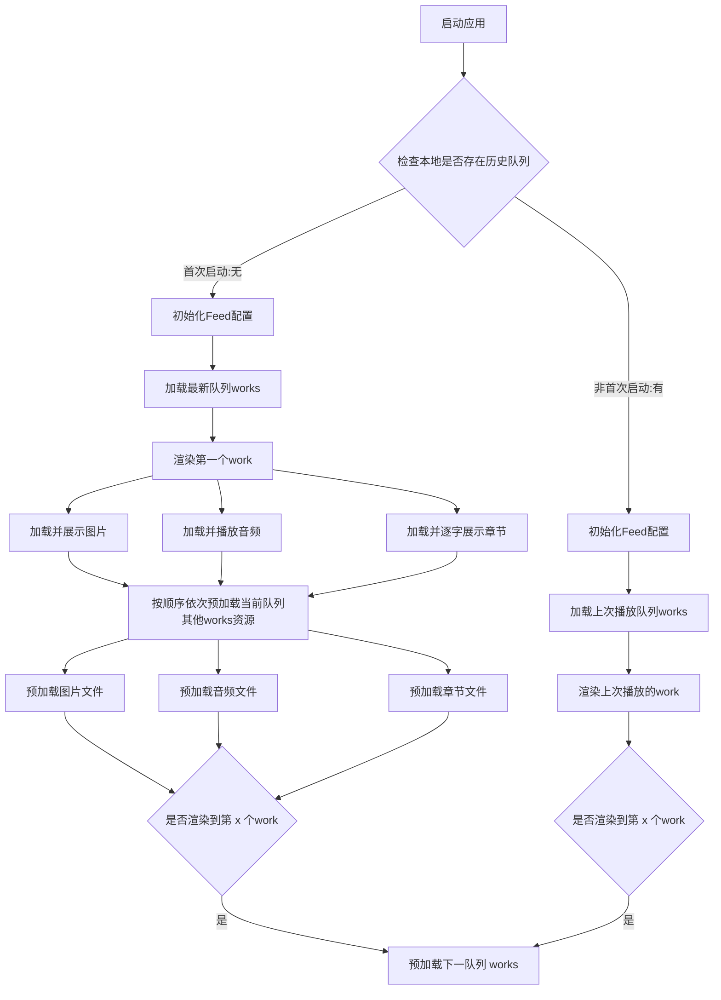
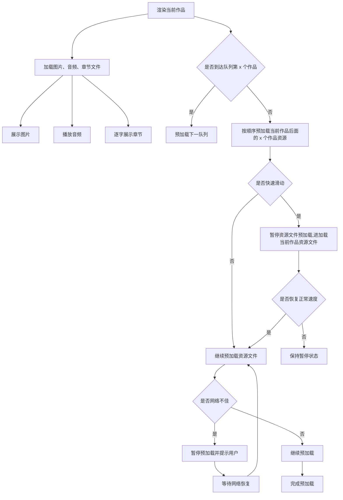
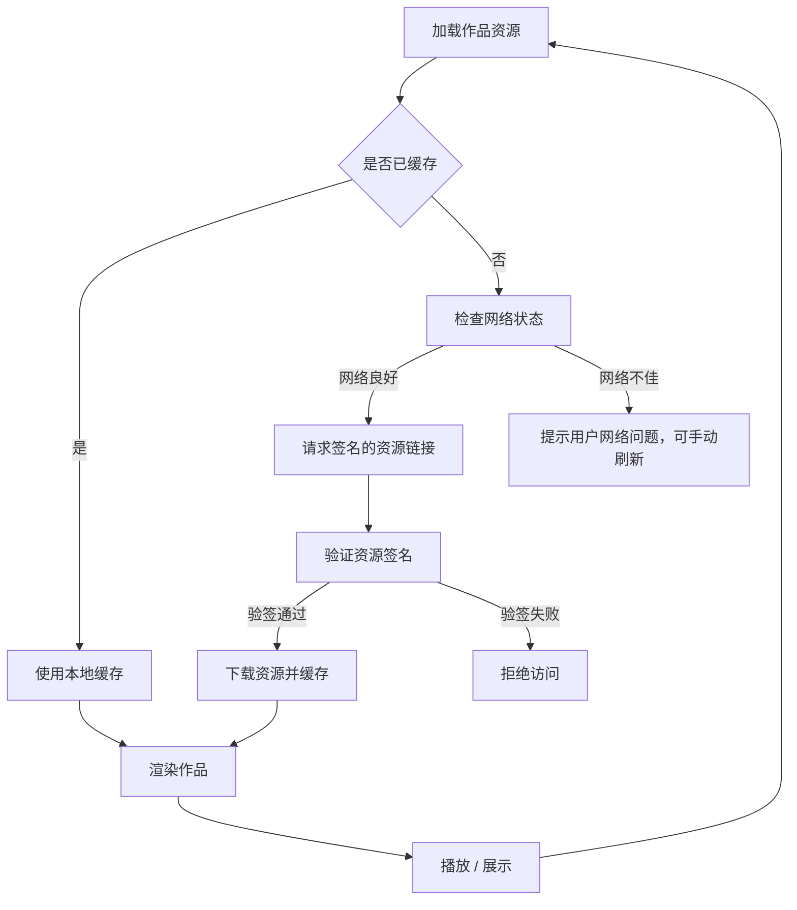
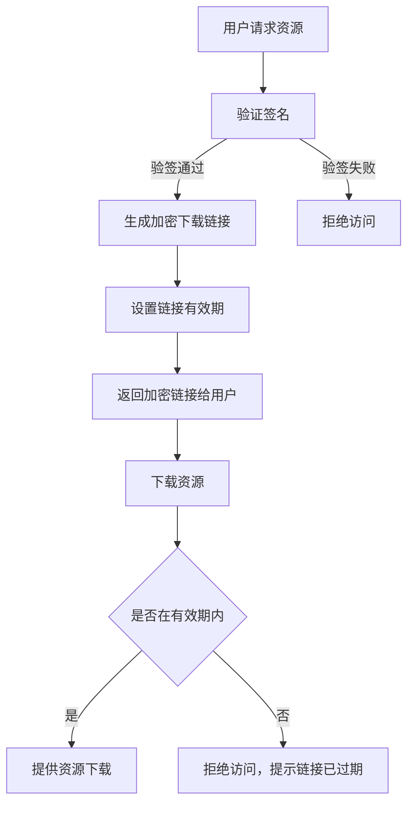

# Feed 详细方案设计

## 方案概述

Feed 页的优化需要兼顾用户体验、流量优化和资源文件的防抓取需求。
通过预加载策略、缓存机制、网络状态检测以及用户控制功能，在保证流畅播放体验的同时，降低流量消耗。
此外，需要通过加密下载链接、验签等技术手段，确保资源文件的安全性，防止被非法抓取和滥用。

1. 提供流畅的播客播放体验，减少等待时间。
2. 优化流量使用，降低CDN流量和用户流量费用。
3. 确保资源文件的安全性，防止被非法抓取和滥用。

## 二、方案设计

### 1. 启动与初始化

- **首次启动**：
  - 加载最新的作品队列数据。
  - 初始化Feed配置。
  - 检测网络状态，根据网络情况调整预加载策略。
- **非首次启动**：
  - 恢复上次播放状态。
  - 加载上次播放的队列数据。
  - 初始化Feed配置。
  - 检测网络状态，根据网络情况调整预加载策略。

### 2. 作品渲染与预加载

- **作品渲染**：
  - 加载当前作品的图片、音频和章节文件。
  - 展示图片，播放音频，逐字展示章节内容。
- **预加载策略**：
  - 当渲染到队列的第3个作品时，开始预加载下一队列。
  - 按顺序预加载当前队列中后续作品的资源文件。
  - 音频文件预加载20%-30%的进度，按需加载更多内容。
  - 网络不佳时暂停预加载，恢复正常速度后重新启动预加载。
  - 预加载资源的优先级，判断work预载的必要性，按需排队预载下一个work的资源文件。

### 3. 缓存机制

- **本地缓存**：
  - 使用URL作为唯一标识，缓存作品的资源文件。
  - 缓存生命周期：在不验签的情况下，URL不变，本地缓存不过期。加上签名后,缓存判断规则待确定。
  - 缓存队列数据：Feed 页内存中缓存单次启动的所有 work 队列，仅将当前播放的队列做本地缓存，便于退出 App 后恢复上次的播放队列，从上次播放的作品开始渲染。
- **内存缓存**：
  - 缓存单次启动的所有队列数据。

### 4. 网络状态检测

- 在每次启动和关键操作时检测网络状态（如4G、5G、Wi-Fi）。
- 根据网络状态调整预加载策略：
  - 网络良好时正常预加载。
  - 网络不佳时暂停预加载并提示用户。

### 5. 用户设置

- 在设置中提供手动控制选项，允许用户在设置中开启或关闭预加载功能。
- 在网络不佳时，提示用户当前预加载状态，用户可选择暂停或继续预加载。

### 6. 滑动交互

- 支持上滑、下滑、连续上划、连续下滑、上下来回划、划到顶、划到底等操作。
- 快速滑动时暂停资源文件的预加载，恢复正常速度后重新启动预加载。

### 7. 流量优化

作品的资源文件大小：

- 数据
  - 1-5 kb
- 资源文件
- 背景：300 - 500kb 的 webp 文件
- 音频：10mb 左右的 mp3 文件
- 章节：1mb 左右的 json 文件

- **优化图片和音频文件**：
  - 使用 WebP 格式图片，减小文件大小。
  - 使用 44100 64k mp3，减小文件大小。
- **启用压缩技术**：
  - 对JSON文件启用Gzip压缩。
- **CDN优化**：
  - 配置CDN缓存策略，设置永不过期的缓存时间。

### 8. 资源文件防抓取

- **加密下载链接**：
  - 对资源文件的下载链接进行签名验证。
- **版权标识**：
  - 在音频文件中添加版权信息，加入音频水印。

## 三、核心流程

### 1. 启动流程

### 2. 作品渲染与预加载流程

---

### 3. 缓存策略流程

### 4. 资源文件防抓取流程

