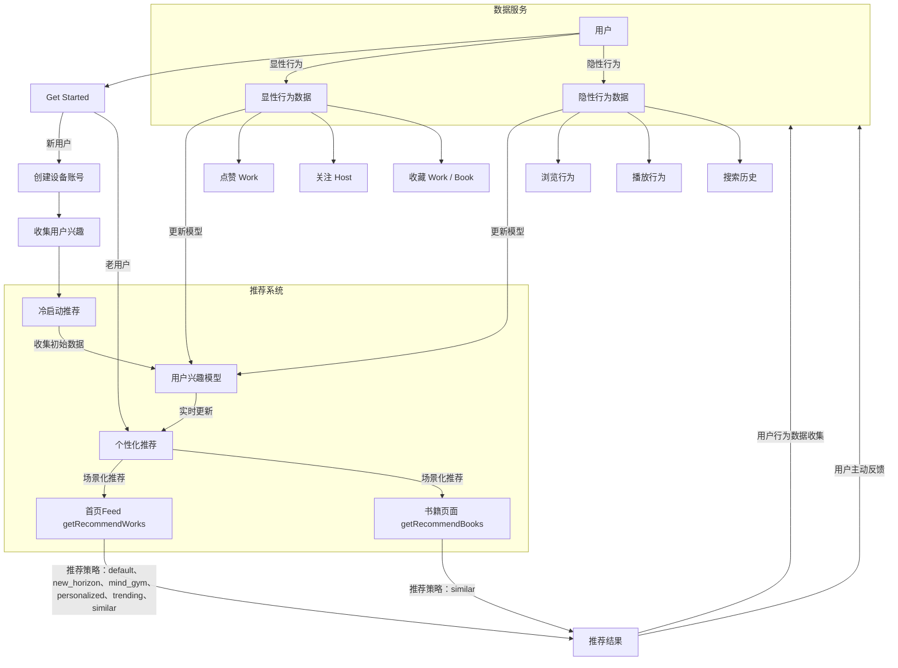
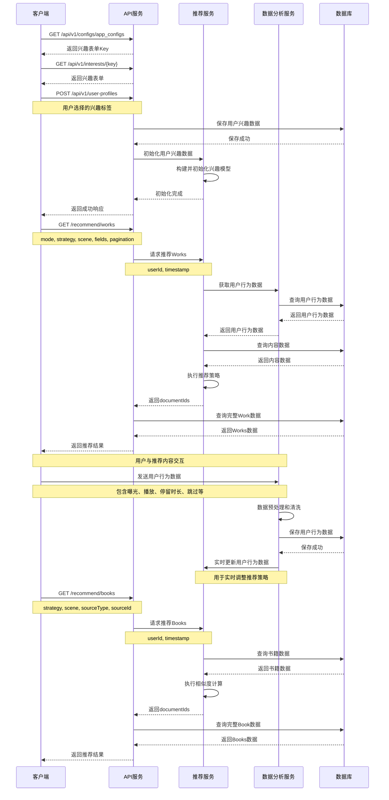

# 推荐域

## 系统概述

推荐服务应用视角方案

## 用例图



## 用例说明

#### 显性兴趣收集

- 用户注册时的兴趣标签选择
  - user_profiles 表
- 用户主动点赞、收藏、关注等互动行为记录
  - user_interacts 表

#### 推荐策略参数

- 个性化推荐（personalized）：基于用户历史行为和兴趣模型
- 热门推荐（trending）：基于实时热度和时间衰减
- 相似推荐（similar）：基于当前内容的相似内容

#### 场景化参数

- 首页Feed（home）
- 书籍页面（book）

#### 数据中心

##### 用户行为数据

- 点击行为
- 停留时长
- 播放进度
- 互动行为
- 分享行为

##### 内容特征数据

- 内容标签
- 内容质量指标
- 时效性指标
- 互动指标

## API

### 序列图



### 获取兴趣表单Key

GET /api/v1/configs/app_configs

测试链接：https://api.dev.rd.ai/api/v1/configs/app_configs

### 获取兴趣表单

GET /api/v1/interests/{key}
测试链接：https://api.dev.rd.ai/api/v1/interests/interest_form_v2

### 保存用户兴趣

POST /api/v1/user-profiles

### 获取 Feed 配置

App 需要动态下发的 Feed 配置

GET /api/v1/configs/app_feed_configs

示例链接：https://api.dev.rd.ai/api/v1/configs/app_feed_configs

返回结果

```json
{
  "data": {
    "key": "app_feed_configs",
    "value": {
      "version": "1.0.0",
      "modes": [
        {
          "key": "default",
          "icon": "home",
          "name": "Default",
          "params": {
            "mode": "default"
          },
          "isDefault": true
        },
        {
          "key": "new_horizon",
          "icon": "compass",
          "name": "NewHorizon",
          "params": {
            "mode": "new_horizon"
          }
        },
        {
          "key": "mind_gym",
          "icon": "brain",
          "name": "MindGym",
          "params": {
            "mode": "mind_gym"
          }
        }
      ],
      "preload": {
        "enabled": true,
        "threshold": 3
      },
      "limit": 10
    }
  }
}
```

返回值说明

- modes：模式列表
  - params：模式参数，一种模式对应一种推荐策略，算法依赖的请求参数可能有多个，可以直接在配置中定义
- preload：预载配置
- limit：每页条数
- App 根据实际情况扩展

### Works 推荐

#### For App

GET /recommend/works

示例链接：https://api.dev.rd.ai/api/v1/recommend/works

##### 请求参数

- 推荐参数
  - mode：推荐模式 default|new_horizon|mind_gym
  - strategy：推荐策略 personalized|trending|similar
  - scene：场景标识 feed｜follow
- 字段参数
  - fields
  - populate
- 游标分页
  - pagination[limit]
  - pagination[cursor]
- 时间标识：timestamp

##### 返回响应

```
{
  "data": [works, ...],
  "meta": {
    "pagination": {
      "limit": 10,
      "next": "wkk17e4kl6j6u538jxr8v865",
      "hasMore": true
    }
  }
}
```

#### 推荐算法提供的接口

##### 请求参数

在 /recommend/works 接口上增加以下参数

- userId：用户Id
- 时间标识：timestamp

##### 返回响应

```json
{
  "data": [{ "documentId": "wkk17e4kl6j6u538jxr8v865" }, { "documentId": "wkk17e4kl6j6u538jxr8v862" }],
  "meta": {
    "pagination": {
      "limit": 10,
      "next": "wkk17e4kl6j6u538jxr8v865",
      "hasMore": true
    }
  }
}
```

### Books 推荐

#### For App

GET /recommend/books

示例链接：https://api.dev.rd.ai/api/v1/recommend/books

##### 请求参数

- 推荐参数
  - strategy：推荐策略 similar
  - scene：场景标识 home|book|after_reading
  - sourceType：book
  - sourceId：bookId
- 字段参数
  - fields
  - populate
- 游标分页
  - pagination[limit]
  - pagination[cursor]

##### 返回响应

```json
{
  "data": [books, ...],
  "meta": {
    "pagination": {
      "limit": 10,
      "next": "wkk17e4kl6j6u538jxr8v865",
      "hasMore": true
    }
  }
}
```

#### 推荐算法提供的接口

##### 请求参数

在 /recommend/books 接口上增加以下参数

- userId：用户Id
- 时间标识：timestamp

##### 返回响应

```json
{
  "data": [{ "documentId": "wkk17e4kl6j6u538jxr8v865" }, { "documentId": "wkk17e4kl6j6u538jxr8v862" }],
  "meta": {
    "pagination": {
      "limit": 10,
      "next": "wkk17e4kl6j6u538jxr8v865",
      "hasMore": true
    }
  }
}
```
