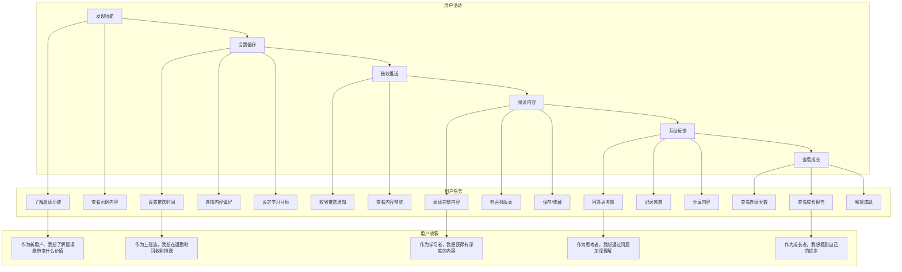
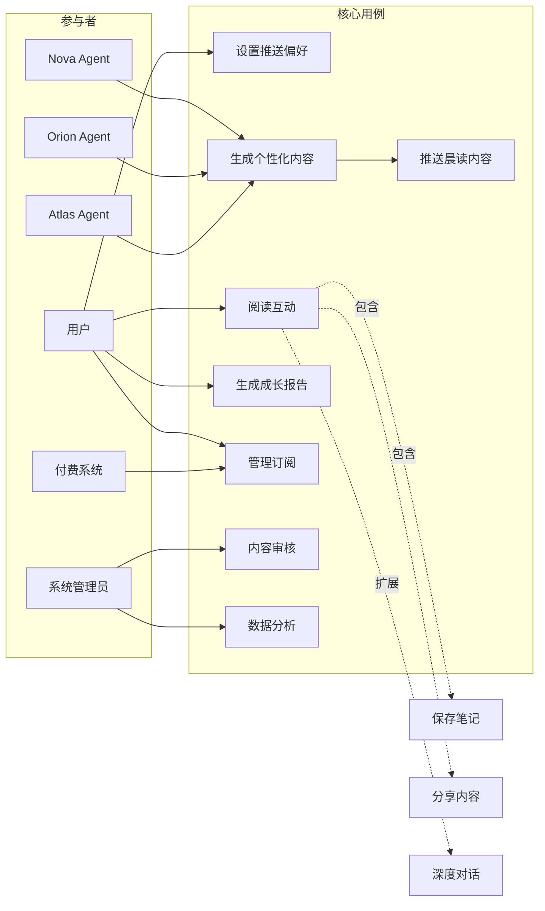

# 需求文档

## 简介

每日晨读功能是 Aibrary 的核心 AI 差异化能力之一，通过 Agent 主动推送个性化内容，帮助用户养成每日学习习惯。该功能将根据用户的学习目标、兴趣偏好、历史行为和当前状态，在每天早晨推送定制化的学习内容，让用户以轻松的方式开启一天的成长之旅。

## 用户故事地图

## 系统用例图

## 需求

### 需求 1：个性化内容生成

**用户故事：** 作为一个终身学习者，我希望每天早晨收到为我量身定制的学习内容，以便我能够持续进步并保持学习动力。

#### 接受标准

1. 当系统到达用户设定的推送时间时，系统应生成包含 5-10 分钟阅读量的个性化内容
2. 如果用户有明确的学习目标，那么系统应确保推送内容与用户当前的学习主题相关
3. 当用户连续 3 天未阅读推送内容时，系统应调整内容难度和长度以重新吸引用户
4. 系统应基于用户的历史阅读完成率动态调整内容长度
5. 如果用户是付费会员，那么系统应提供更深度的内容和独家资源

#### 用例场景

**场景 1：新用户首次体验**
- 前置条件：用户刚注册，尚未设置任何偏好
- 主要流程：
  1. 系统推送欢迎内容和晨读功能介绍
  2. 提供 3 篇不同主题的示例内容供用户选择
  3. 根据用户的选择初始化内容偏好模型
- 异常流程：用户跳过选择 → 系统使用通用内容模板

**场景 2：个性化内容匹配**
- 前置条件：用户已使用晨读功能超过 7 天
- 主要流程：
  1. Nova 分析用户的学习目标和近期关注点
  2. Orion 从知识库中检索相关内容
  3. 系统结合用户画像生成个性化内容
  4. Atlas 添加相关的行动建议
- 异常流程：无匹配内容 → 扩大搜索范围或推荐相近主题

### 需求 2：智能推送时机

**用户故事：** 作为一个有固定作息的用户，我希望在最适合我的时间收到晨读推送，以便我能够在最佳状态下进行学习。

#### 接受标准

1. 当用户首次使用时，系统应提供默认推送时间选项（如 7:00、7:30、8:00）
2. 如果用户手动设置了推送时间，那么系统应在该时间准时推送
3. 当系统检测到用户经常在非推送时间打开应用时，系统应建议调整推送时间
4. 如果用户处于免打扰模式，那么系统应延迟推送直到免打扰结束
5. 系统应支持工作日和周末的差异化推送时间设置

#### 用例场景

**场景 1：智能时间推荐**
- 前置条件：用户使用晨读功能超过 14 天
- 主要流程：
  1. 系统分析用户的应用打开时间模式
  2. 识别用户的最佳学习时间窗口
  3. 主动推荐调整推送时间
  4. 用户确认后更新推送设置
- 异常流程：用户拒绝建议 → 保持原有设置，30 天后再次分析

**场景 2：时区自适应**
- 前置条件：用户出差或旅行到不同时区
- 主要流程：
  1. 系统检测到设备时区变化
  2. 询问用户是否调整推送时间
  3. 提供"保持本地时间"或"保持原时区时间"选项
  4. 根据选择更新推送逻辑
- 异常流程：无法确定时区 → 暂停推送并提醒用户手动设置

### 需求 3：内容形式多样化

**用户故事：** 作为一个喜欢多样化学习的用户，我希望晨读内容有不同的形式，以便保持新鲜感和学习兴趣。

#### 接受标准

1. 系统应支持至少 4 种内容形式：图书精华、播客摘要、思维模型、每日反思
2. 当用户连续收到同一类型内容超过 3 天时，系统应自动切换内容类型
3. 如果用户对某种内容形式的完成率低于 30%，那么系统应减少该类型内容的推送频率
4. 系统应根据工作日和周末调整内容深度和类型
5. 付费用户可以自定义内容形式的推送比例

#### 用例场景

**场景 1：内容形式轮换**
- 前置条件：用户已订阅晨读功能
- 主要流程：
  1. 系统根据用户偏好和历史数据确定内容类型
  2. 周一至周三：推送图书精华或思维模型（深度内容）
  3. 周四至周五：推送播客摘要或行业洞察（轻松内容）
  4. 周末：推送每日反思或成长故事（启发性内容）
- 异常流程：用户手动请求特定类型 → 优先满足用户需求

**场景 2：多媒体内容呈现**
- 前置条件：用户网络状况良好
- 主要流程：
  1. 文字内容配备 AI 生成的音频版本
  2. 重要概念配备可视化图表
  3. 提供"切换阅读模式"选项（文字/音频/图文）
  4. 记录用户的模式偏好
- 异常流程：网络不佳 → 优先加载文字版本

### 需求 4：互动与反馈机制

**用户故事：** 作为一个希望深度学习的用户，我希望能够与晨读内容进行互动，以便加深理解和记忆。

#### 接受标准

1. 当用户阅读完内容后，系统应提供 1-2 个思考问题引导用户反思
2. 如果用户对内容进行了标注或评论，那么系统应将这些反馈纳入后续内容推荐
3. 当用户完成连续 7 天的晨读时，系统应生成个人成长报告
4. 系统应支持用户一键分享晨读内容到社交平台
5. 付费用户可以与 Agent 进行深度对话讨论晨读内容

#### 用例场景

**场景 1：引导式反思**
- 前置条件：用户完成当日晨读
- 主要流程：
  1. 系统展示与内容相关的开放性问题
  2. 用户可以选择语音或文字方式回答
  3. Nova 对用户的回答给予正向反馈
  4. 系统保存反思记录用于生成成长报告
- 异常流程：用户跳过反思 → 记录行为但不强制

**场景 2：社交分享激励**
- 前置条件：用户对内容反馈积极
- 主要流程：
  1. 系统生成精美的分享卡片
  2. 包含核心观点和用户的个人感悟
  3. 一键分享到微信、微博等平台
  4. 分享后获得成长积分奖励
- 异常流程：分享失败 → 保存到本地相册

### 需求 5：Agent 团队协作

**用户故事：** 作为 Aibrary 用户，我希望 Nova、Orion 和 Atlas 三个 Agent 能够协同为我准备晨读内容，以便获得更全面的学习体验。

#### 接受标准

1. Nova 应基于用户画像和成长目标确定晨读主题方向
2. Orion 应从知识库中搜索和整理相关高质量内容
3. Atlas 应将内容转化为可执行的微任务或行动建议
4. 当用户对某个 Agent 的内容反馈较差时，系统应调整该 Agent 的参与权重
5. 系统应展示每个 Agent 的贡献，增强用户的团队陪伴感

#### 用例场景

**场景 1：协同内容生成**
- 前置条件：到达推送时间
- 主要流程：
  1. Nova 分析用户状态，确定今日主题（如"提升专注力"）
  2. Orion 搜索相关图书章节和研究成果
  3. Atlas 设计 3 个可在当天执行的专注力练习
  4. 三个 Agent 共同呈现一份完整的晨读内容
- 异常流程：Agent 意见冲突 → Nova 作为首席官做最终决策

**场景 2：个性化 Agent 互动**
- 前置条件：用户阅读过程中有疑问
- 主要流程：
  1. 用户可以选择向特定 Agent 提问
  2. 被选中的 Agent 以其特色方式回应
  3. 其他 Agent 可以补充不同视角
  4. 形成多角度的知识理解
- 异常流程：Agent 无法回答 → 承认限制并推荐相关资源

### 需求 6：数据追踪与优化

**用户故事：** 作为产品运营者，我希望能够追踪晨读功能的使用情况，以便持续优化产品体验。

#### 接受标准

1. 系统应记录每次推送的打开率、完成率和互动率
2. 当某类内容的平均完成率低于 50% 时，系统应触发内容质量审查
3. 系统应支持 A/B 测试不同的内容策略和推送时间
4. 如果用户连续 7 天未打开晨读，那么系统应触发用户召回策略
5. 系统应生成每周运营报告，包含关键指标和优化建议

#### 用例场景

**场景 1：用户行为分析**
- 前置条件：用户使用晨读功能超过 30 天
- 主要流程：
  1. 系统分析用户的阅读完成率趋势
  2. 识别用户偏好的内容类型和阅读时长
  3. 生成个人阅读行为报告
  4. 基于分析结果优化推送策略
- 异常流程：数据不足 → 延长分析周期

**场景 2：内容效果评估**
- 前置条件：某篇内容推送给超过 100 个用户
- 主要流程：
  1. 统计内容的各项指标（打开率、完成率、分享率）
  2. 分析用户反馈和评论情感
  3. 对比同类内容的历史表现
  4. 生成内容质量评分和改进建议
- 异常流程：指标异常 → 人工复核内容质量

### 需求 7：商业化机制

**用户故事：** 作为产品经理，我希望晨读功能能够支持多层次的商业化策略，以便实现可持续发展。

#### 接受标准

1. 系统应支持免费版和付费版的差异化功能
2. 当免费用户达到每月阅读上限时，系统应引导其升级为付费用户
3. 付费用户应享有独家内容、深度对话、个性化定制等高级功能
4. 系统应支持多种付费模式：月卡、季卡、年卡
5. 如果用户付费即将到期，系统应提前 3 天发送续费提醒

#### 用例场景

**场景 1：免费版体验限制**
- 前置条件：用户为免费版用户
- 主要流程：
  1. 每月提供 20 篇精选晨读内容
  2. 基础的内容形式（仅文字版）
  3. 简单的反思问题（无 Agent 互动）
  4. 达到限制后展示付费版权益对比
- 异常流程：用户反复注册新账号 → 设备识别限制

**场景 2：付费转化引导**
- 前置条件：免费用户连续使用 7 天
- 主要流程：
  1. 展示付费版独家内容预览
  2. 提供限时优惠（首月半价）
  3. 强调个性化定制和 Agent 深度对话功能
  4. 支持多种支付方式
- 异常流程：支付失败 → 提供客服支持

### 需求 8：推荐算法逻辑

**用户故事：** 作为算法工程师，我需要设计一个智能推荐系统，确保每个用户都能收到最合适的晨读内容。

#### 接受标准

1. 系统应基于协同过滤和内容特征混合推荐
2. 当用户画像不完整时，系统应使用冷启动策略
3. 推荐算法应考虑时效性、相关性、多样性三个维度
4. 系统应实时更新用户兴趣模型
5. 算法应支持人工干预和规则配置

#### 用例场景

**场景 1：个性化推荐计算**
- 前置条件：系统准备生成晨读内容
- 主要流程：
  1. 提取用户特征向量（兴趣标签、行为历史、当前目标）
  2. 计算内容相关性得分（主题匹配度）
  3. 考虑内容新鲜度和多样性约束
  4. 综合 Nova 的成长规划建议
  5. 输出最终推荐内容
- 算法公式：Score = α·相关性 + β·新鲜度 + γ·多样性 + δ·成长价值

**场景 2：实时反馈学习**
- 前置条件：用户完成内容阅读
- 主要流程：
  1. 收集用户行为信号（阅读时长、完成率、互动情况）
  2. 更新用户兴趣权重
  3. 调整内容类型偏好
  4. 优化推送时间模型
  5. 将学习结果应用到下次推荐
- 异常流程：行为异常 → 保持原有模型，标记异常数据

#### 推荐策略细节

**内容选择维度：**
- 主题相关性（40%）：与用户当前学习目标的匹配度
- 难度适配性（20%）：内容深度与用户水平的匹配
- 时间合适性（20%）：内容长度与用户可用时间的匹配
- 新颖性（10%）：避免重复推荐相似内容
- 趋势性（10%）：结合当前热点和时事

**用户分层策略：**
- 新用户：通用高质量内容 + 兴趣探索
- 活跃用户：深度个性化 + 挑战性内容
- 沉睡用户：轻松有趣内容 + 激励机制
- 付费用户：独家精品 + 定制化服务