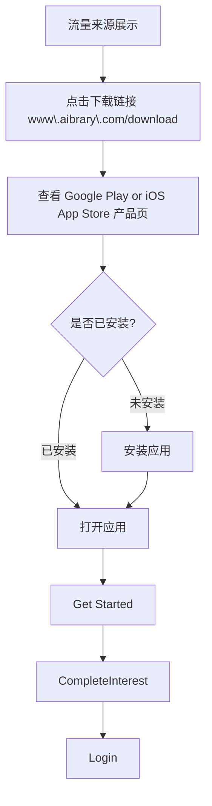
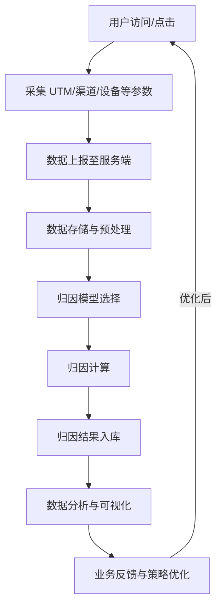

# 归因分析技术方案

## 简介

归因分析是指通过分析用户行为数据，了解用户是从哪个渠道、媒介、来源进入到您的应用或网站的。通过归因分析，您可以了解用户的行为模式、兴趣爱好、购买意向等信息，从而更好地了解用户的需求和偏好，为用户提供更优质的服务。

## 需求

- 广告平台
- 社交媒体
- 应用市场
- 搜索引擎
- 营销活动
  - 达人营销
  - 邮件营销
  - 用户推荐
  - 用户分享
- 官方网站
- 自然流量
- 其他渠道

## 流程

### 一次有效的转化流程

### 归因份需求统计的数据

1. 用户获取
   - UTM 参数跟踪
     - utm_source: 流量来源
     - utm_medium: 营销媒介
     - utm_campaign: 营销活动
     - utm_term: 关键词
     - utm_content: 广告内容
   - 渠道标识
     - channel_id: 渠道唯一标识
     - sub_channel_id: 子渠道标识
   - 设备信息
     - device_id: 设备唯一标识
     - platform: 平台（iOS/Android/Web）
     - os_version: 操作系统版本
     - app_version: 应用版本

2. 数据收集
   - 首次访问记录
     - first_visit_source: 首次访问来源
     - first_visit_time: 首次访问时间
   - 转化行为
     - registration: 注册
     - purchase: 购买
     - subscription: 订阅
   - 用户行为
     - page_view: 页面访问
     - content_view: 内容查看
     - interaction: 互动行为

3. 归因模型
   - 首次触点归因（First Touch Attribution）
   - 最后触点归因（Last Touch Attribution）
   - 线性归因（Linear Attribution）
   - 时间衰减归因（Time Decay Attribution）
   - 位置归因（Position Based Attribution）

### 归因分析核心流程

## 下载链接

1. 应用商店下载
   - App Store（iOS）
   - Google Play（Android）

2. 直接下载
   - 官网下载页面
   - 活动页面
   - 分享页面

## 深度链接

1. Android App Links
   - 配置 Digital Asset Links
   - 验证域名所有权
   - 实现 Intent Filter
   - 处理深度链接跳转

2. iOS Universal Links
   - 配置 Associated Domains
   - 生成 apple-app-site-association 文件
   - 实现 Universal Links 处理
   - 处理深度链接跳转

## 方案一：官网下载链接跳转

## 方案二：三方归因平台 - AppsFlyer、Adjust、Branch

## 归因分析

1. 数据指标
   - 获客成本（CAC）
   - 用户生命周期价值（LTV）
   - 渠道转化率
   - 用户留存率
   - ROI 分析

2. 分析维度
   - 渠道分析
   - 活动分析
   - 地域分析
   - 设备分析
   - 时间分析

3. 数据应用
   - 渠道优化
   - 预算分配
   - 营销策略调整
   - 用户画像分析
   - ROI 优化
