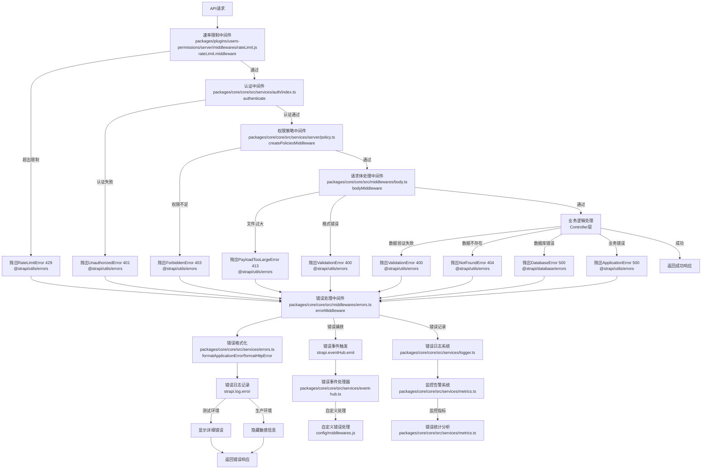
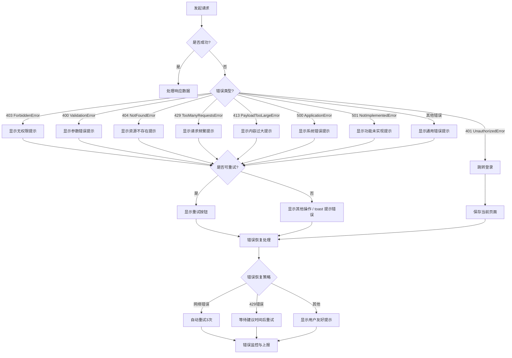

# REST API 错误处理方案

### 错误处理文档

https://docs-next.strapi.io/cms/error-handling#default-error-classes

### 错误响应示例

```json
{
  "data": null,
  "error": {
    // 错误代码,与 HTTP 状态码一致
    "status": 400,
    // 错误类型，语义化
    "name": "ValidationError",
    // 错误提示
    "message": "请检查输入内容是否正确",
    // 错误详情
    "details": {
      // 业务错误代码
      "code": "USER_INTERACT_REPEATED",
      // 业务错误原因
      "reason": "已经点赞过该内容"
    }
  }
}
```

## 错误类型对照表

| name                 | status | 使用场景               | 错误提示(中/英)                                                           |
| -------------------- | ------ | ---------------------- | ------------------------------------------------------------------------- |
| ValidationError      | 400    | 请求参数不符合验证规则 | 请检查输入内容是否正确<br/>Please check if the input is correct           |
| UnauthorizedError    | 401    | 未登录或 token 失效    | 请先登录后再试<br/>Please login first                                     |
| ForbiddenError       | 403    | 无权限访问资源         | 您没有权限执行此操作<br/>You don't have permission to perform this action |
| PolicyError          | 403    | 策略检查失败           | 策略检查未通过<br/>Policy check failed                                    |
| NotFoundError        | 404    | 请求的资源不存在       | 未找到相关内容<br/>Resource not found                                     |
| TooManyRequestsError | 429    | 请求频率超过限制       | 操作频繁，请稍后再试<br/>Too many requests, please try again later        |
| PayloadTooLargeError | 413    | 上传文件过大等情况     | 上传内容过大<br/>Payload too large                                        |
| ApplicationError     | 500    | 服务器内部错误         | 系统繁忙，请稍后再试<br/>System is busy, please try again later           |
| NotImplementedError  | 501    | 功能未实现             | 该功能尚未实现<br/>This feature is not implemented                        |

### 业务错误码

| code                   | 说明           | 使用场景                 |
| ---------------------- | -------------- | ------------------------ |
| USER_INTERACT_REPEATED | 重复的互动操作 | 用户重复点赞、收藏等操作 |

## 服务端错误处理方案

### 服务端错误处理流程

请求生命周期错误处理流程图



### 错误类使用说明

Strapi 提供了一系列标准错误类，可以从 `@strapi/utils` 包中导入使用：

```typescript
import { errors } from '@strapi/utils';

// 应用错误 - 用于处理一般性的应用错误
throw new errors.ApplicationError('系统错误', { foo: 'bar' });

// 验证错误 - 用于处理数据验证失败
throw new errors.ValidationError('验证失败');

// 资源未找到错误 - 用于处理请求的资源不存在
throw new errors.NotFoundError('资源不存在');

// 权限错误 - 用于处理无权限访问
throw new errors.ForbiddenError('权限不足');

// 未授权错误 - 用于处理未登录或认证失败
throw new errors.UnauthorizedError('请先登录');

// 未实现错误 - 用于处理功能未实现
throw new errors.NotImplementedError('功能未实现');

// 请求体过大错误 - 用于处理上传文件过大等情况
throw new errors.PayloadTooLargeError('上传文件过大');

// 策略错误 - 用于处理策略检查失败
throw new errors.PolicyError('策略检查失败', { policy: 'my-policy' });
```

### 在 controller 中使用

在控制器中，使用 `ctx` 上下文对象提供的错误处理方法：

```typescript
module.exports = {
  async create(ctx) {
    const { name } = ctx.request.body;
    if (!name) {
      // 使用 ctx.badRequest() 返回 400 错误
      return ctx.badRequest('名称不能为空', { field: 'name' });
    }
    // ...
  },
};
```

### 在 service 中使用

在 service 层中，使用错误类抛出异常：

```typescript
const { ApplicationError } = require('@strapi/utils').errors;

module.exports = {
  async create(data) {
    const { name } = data;
    if (!name) {
      throw new ApplicationError('名称不能为空');
    }
    // ...
  },
};
```

### 在 model 生命周期中使用

在 model 生命周期钩子中，使用 `ApplicationError`：

```typescript
const { ApplicationError } = require('@strapi/utils').errors;

module.exports = {
  beforeCreate(event) {
    const { data } = event.params;
    if (!data.name) {
      throw new ApplicationError('名称不能为空');
    }
  },
};
```

### 在 policy 中使用

在策略中，使用专门的 `PolicyError` 错误类：

```typescript
const { PolicyError } = require('@strapi/utils').errors;

module.exports = (policyContext, config, { strapi }) => {
  if (!policyContext.state.user) {
    throw new PolicyError('未登录', {
      policy: 'is-authenticated',
      // 可以添加更多上下文信息
      details: '用户未通过身份验证',
    });
  }
  return true;
};
```

## App 端错误处理方案

### 客户端错误处理流程



### 统一拦截

```typescript
// 请求拦截器
axios.interceptors.response.use(
  response => response,
  error => {
    const { status, data } = error.response || {};
    if (response.config.prevent) {
      return true;
    }

    switch (status) {
      // token 过期
      case '401':
        redirectLogin();
        return false;
      case '403':
        redirectException('403');
        return false;
      case '404':
        redirectException('400');
        return false;
      case '500':
      case '501':
      case '502':
      case '503':
      case '504':
        redirectException('500');
        return false;
    }
    if (!response.config.silent) {
      if (message && message.length > 100) {
        Modal.error({
          width: 800,
          title: `请求错误 ${code}: ${response.config.url}`,
          content: message,
        });
      } else {
        notification.error({
          message: `请求错误 ${code}: ${response.config.url}`,
          description: message,
        });
      }
    }
    return true;
  },
);
```

### 重试策略

- 网络错误：自动重试 3 次，间隔递增
- 429 状态码：等待建议时间后重试
- 401 状态码：退出到登录页面

### 错误恢复

- 保存用户输入，避免数据丢失
- 提供重试按钮
- 关键操作失败后的回滚机制

### 错误监控

- 记录错误详情用于分析
- 上报关键错误到监控平台
- 定期分析错误趋势优化体验

### 错误提示

- 根据错误类型显示合适的提示
