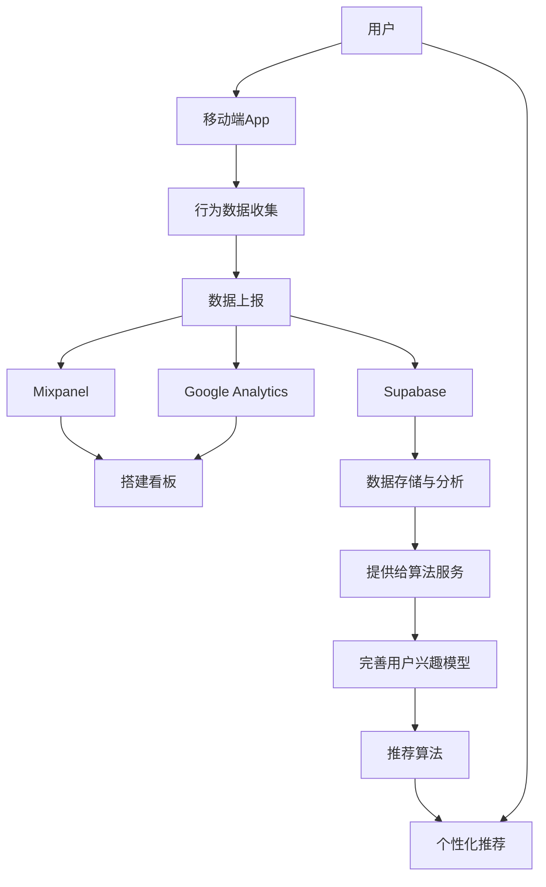

## 用例视图

```mermaid
graph TD
    用户 --> 移动端App
    移动端App --> 行为数据收集
    行为数据收集 --> 数据上报
    数据上报 --> Mixpanel
    数据上报 --> Google_Analytics[Google Analytics]
    数据上报 --> Supabase
    Mixpanel --> 搭建看板
    Google_Analytics --> 搭建看板
    Supabase --> 数据存储与分析
    数据存储与分析 --> 提供给算法服务
    提供给算法服务 --> 完善用户兴趣模型
    完善用户兴趣模型 --> 推荐算法
    推荐算法 --> 个性化推荐
    用户 --> 个性化推荐
```
