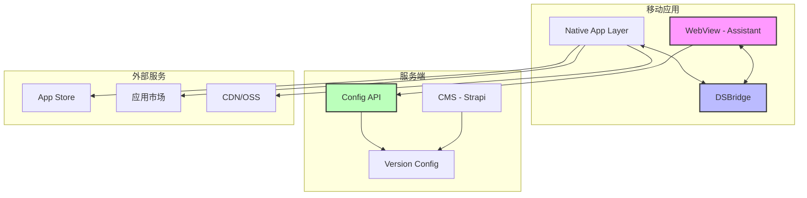

# App 更新功能设计文档

## 概述

本设计文档详细说明了 Aibrary 移动应用版本更新功能的技术实现方案。该功能基于现有的 DSBridge 通信机制，结合 CMS 配置管理和 Next.js 前端框架，实现了完整的版本检测、更新提示、下载安装流程。

设计充分考虑了用户体验、系统可扩展性和错误容错性，支持普通更新和强制更新两种模式，并提供了灰度发布能力。

## 架构

### 系统架构图



### 核心组件

1. **Native 层**
   - 实现 DSBridge 接口，提供版本信息获取和更新控制
   - 处理应用商店跳转和 APK 下载安装
   - 管理下载进度和安装流程

2. **WebView 层（Assistant）**
   - UpdateService：版本检查和比较逻辑
   - UpdateDialog：更新提示 UI 组件
   - DSBridge 接口封装

3. **服务端（CMS）**
   - Config API：存储和管理版本配置
   - 版本管理界面：运营人员配置版本信息
   - 灰度发布控制

## 组件和接口

### DSBridge 接口定义

```typescript
interface AppUpdateBridge {
  // 获取当前应用版本信息
  getAppVersion(): Promise<AppVersionInfo>;

  // 检查更新（Native 实现可选）
  checkAppUpdate(): Promise<UpdateInfo>;

  // 下载更新包
  downloadUpdate(): Promise<void>;

  // 安装更新
  installUpdate(): Promise<void>;

  // 打开应用商店
  openAppStore(url: string): Promise<void>;
}

interface AppVersionInfo {
  currentVersion: string; // 版本号 x.y.z
  buildNumber: string; // 构建号
  platform: 'ios' | 'android';
  deviceId?: string; // 设备标识（用于灰度）
  channel?: string; // 渠道信息
}
```

### 服务端 API

```typescript
// GET /api/config/app-update
interface AppUpdateConfigResponse {
  ios: PlatformConfig;
  android: PlatformConfig;
  grayScale?: GrayScaleConfig;
}

interface PlatformConfig {
  latestVersion: string;
  minVersion: string;
  updateNotes: string;
  downloadUrl: string;
  forceUpdate: boolean;
  updateSize: number;
  channels?: ChannelConfig[]; // 渠道配置
}

interface GrayScaleConfig {
  enabled: boolean;
  percentage: number; // 灰度比例 0-100
  whitelist?: string[]; // 白名单设备
  blacklist?: string[]; // 黑名单设备
  userTags?: string[]; // 用户标签
}
```

### 前端组件结构

```
src/
├── lib/
│   ├── js-bridge/
│   │   ├── app-update.ts      # DSBridge 接口封装
│   │   └── index.ts
│   └── services/
│       └── update.service.ts   # 更新检查服务
├── components/
│   └── update-dialog.tsx       # 更新提示对话框
└── hooks/
    └── use-app-update.ts       # 更新检查 Hook
```

## 数据模型

### CMS 数据结构

```typescript
// Content Type: AppVersion
interface AppVersion {
  id: string;
  platform: 'ios' | 'android';
  version: string;
  buildNumber: number;
  releaseNotes: string;
  downloadUrl: string;
  fileSize: number;
  minSupportedVersion: string;
  forceUpdate: boolean;
  releaseDate: Date;
  isActive: boolean;
  grayScaleConfig?: {
    enabled: boolean;
    percentage: number;
    whitelist: string[];
    userTags: string[];
  };
}

// Config: app_update_config
interface AppUpdateConfig {
  ios: {
    latestVersion: string;
    // ... PlatformConfig
  };
  android: {
    latestVersion: string;
    // ... PlatformConfig
  };
}
```

### 本地存储

```typescript
// LocalStorage Keys
const UPDATE_STORAGE_KEYS = {
  LAST_CHECK_TIME: 'app_update_last_check',
  SKIPPED_VERSION: 'app_update_skipped_version',
  CHECK_INTERVAL: 'app_update_check_interval',
};

// 存储结构
interface UpdateCheckRecord {
  timestamp: number;
  version: string;
  result: 'updated' | 'skipped' | 'failed';
}
```

## 错误处理

### 错误类型定义

```typescript
enum UpdateErrorCode {
  NETWORK_ERROR = 'UPDATE_NETWORK_ERROR',
  CONFIG_NOT_FOUND = 'UPDATE_CONFIG_NOT_FOUND',
  INVALID_VERSION = 'UPDATE_INVALID_VERSION',
  DOWNLOAD_FAILED = 'UPDATE_DOWNLOAD_FAILED',
  INSTALL_FAILED = 'UPDATE_INSTALL_FAILED',
  PLATFORM_NOT_SUPPORTED = 'UPDATE_PLATFORM_NOT_SUPPORTED',
}

class UpdateError extends Error {
  constructor(
    public code: UpdateErrorCode,
    message: string,
    public details?: any,
  ) {
    super(message);
  }
}
```

### 错误处理策略

1. **网络错误**
   - 静默失败，不影响应用使用
   - 记录错误日志
   - 下次启动时重试

2. **配置错误**
   - 使用默认配置
   - 通知运营人员检查配置

3. **下载/安装错误**
   - 显示错误提示
   - 提供重试选项
   - 记录失败原因

## 测试策略

### 单元测试

```typescript
// update.service.test.ts
describe('UpdateService', () => {
  describe('compareVersions', () => {
    it('应该正确比较版本号', () => {
      expect(compareVersions('1.2.3', '1.2.2')).toBe(1);
      expect(compareVersions('1.2.0', '1.2.0')).toBe(0);
      expect(compareVersions('1.2', '1.2.1')).toBe(-1);
    });
  });

  describe('checkForUpdates', () => {
    it('应该检测到新版本', async () => {
      // Mock getAppVersion 返回 1.0.0
      // Mock getAppConfig 返回 1.1.0
      const result = await updateService.checkForUpdates();
      expect(result.hasUpdate).toBe(true);
    });
  });
});
```

### 集成测试

1. **版本检查流程**
   - 模拟不同版本场景
   - 测试强制更新逻辑
   - 验证灰度发布

2. **UI 交互测试**
   - 更新对话框显示
   - 按钮交互响应
   - 下载进度更新

3. **错误场景测试**
   - 网络断开
   - 配置错误
   - 下载中断

### E2E 测试场景

```typescript
// e2e/app-update.spec.ts
describe('App更新功能', () => {
  it('普通更新流程', async () => {
    // 1. 设置当前版本为 1.0.0
    // 2. 配置最新版本为 1.1.0
    // 3. 打开应用
    // 4. 验证更新对话框显示
    // 5. 点击"稍后更新"
    // 6. 验证对话框关闭
  });

  it('强制更新流程', async () => {
    // 1. 设置当前版本低于最低版本
    // 2. 打开应用
    // 3. 验证强制更新对话框
    // 4. 验证无法关闭对话框
    // 5. 点击更新按钮
    // 6. 验证跳转到应用商店
  });
});
```

## 性能考虑

1. **检查频率优化**
   - 启动时检查一次
   - 后台定时检查（默认 1 小时）
   - 使用缓存避免频繁请求

2. **下载优化**
   - 支持断点续传
   - 后台下载能力
   - 进度实时反馈

3. **UI 性能**
   - 对话框懒加载
   - 动画流畅度优化
   - 避免阻塞主线程

## 安全考虑

1. **版本校验**
   - 版本配置签名验证
   - 下载文件完整性校验
   - HTTPS 传输

2. **权限控制**
   - CMS 版本管理权限
   - 灰度发布审批流程
   - 操作日志记录

3. **隐私保护**
   - 设备标识匿名化
   - 用户数据最小化收集
   - 遵循隐私政策

## 扩展性设计

1. **多渠道支持**
   - 不同应用市场配置
   - 渠道包版本管理
   - 自定义下载源

2. **A/B 测试**
   - 更新提示文案测试
   - UI 样式测试
   - 转化率对比

3. **增量更新**
   - 预留增量包支持
   - 差分算法接口
   - 智能更新策略

## 部署和配置

### 环境配置

```bash
# .env.production
NEXT_PUBLIC_UPDATE_CHECK_INTERVAL=3600000  # 检查间隔（毫秒）
NEXT_PUBLIC_UPDATE_CHECK_ENABLED=true      # 是否启用更新检查
```

### CMS 配置步骤

1. 创建 AppVersion 内容类型
2. 配置版本管理权限
3. 初始化版本配置数据
4. 设置 Webhook 通知

### 监控指标

- 版本分布统计
- 更新成功率
- 下载失败率
- 用户响应率
- 强制更新完成率
