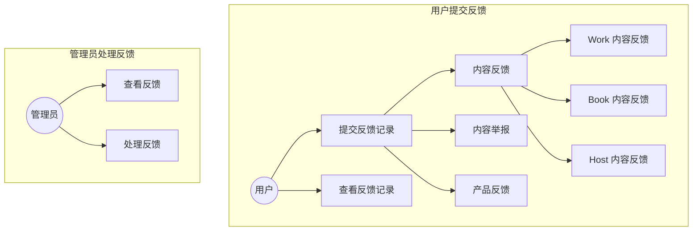
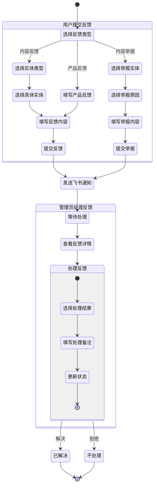
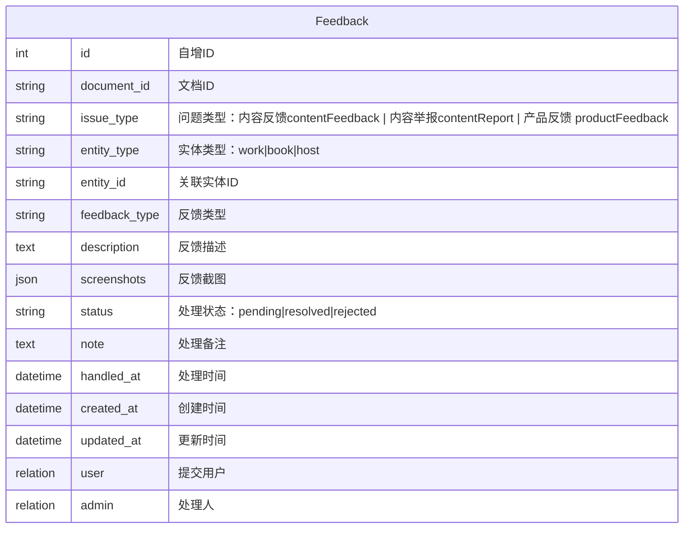

# 反馈模块

## 概述

反馈模块是一个通用的用户反馈收集和管理系统，用于处理多种类型的用户反馈，包括内容反馈、内容举报和产品反馈。支持：

1. 多实体反馈：支持对 Work、Book、Host 等多种内容实体的反馈
2. 灵活配置：支持扩展问题类型和反馈类型
3. 问题处理：反馈状态全程可追踪，支持处理备注

## 用例图



## 活动图



# E-R 图



## API 设计

### 2.1 获取反馈配置

```typescript
// 获取反馈配置
GET /config/feedback
Response:
{
  issueTypes: {
    contentFeedback: {
      label: "内容反馈",
      feedbackTypes: [
        { value: 'incorrect_info', label: '信息错误' },
        { value: 'content_quality', label: '内容质量问题' }
        // ...
      ]
    },
    contentReport: {
      label: "内容举报",
      feedbackTypes: [
        { value: 'inappropriate', label: '不当内容' },
        { value: 'copyright', label: '版权问题' }
        // ...
      ]
    },
    productFeedback: {
      label: "产品反馈",
      feedbackTypes: [
        { value: 'bug', label: '功能异常' },
        { value: 'suggestion', label: '功能建议' }
        // ...
      ]
    }
  }
}
```

### 2.2 用户提交反馈

````typescript
// 提交反馈
POST /feedbacks
Request Body: {
  issueType: string;
  entityType?: string;
  entityId?: string;
  feedbackType: string;
  description: string;
  screenshots?: string[];
  contactInfo?: string;
}

// 上传反馈截图
POST /feedbacks/upload
Request: FormData (file)
Response: {
  url: string;
}


### 2.3 获取用户反馈列表
```typescript
// 获取用户反馈列表
GET /user/feedbacks
````
