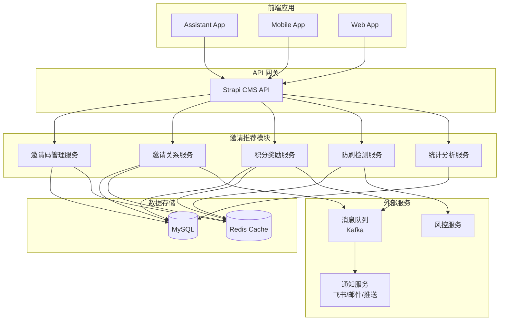
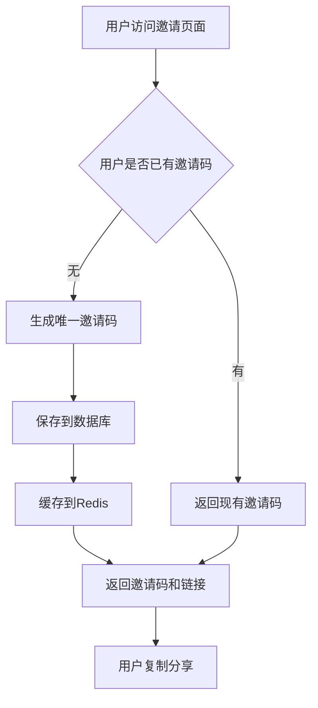
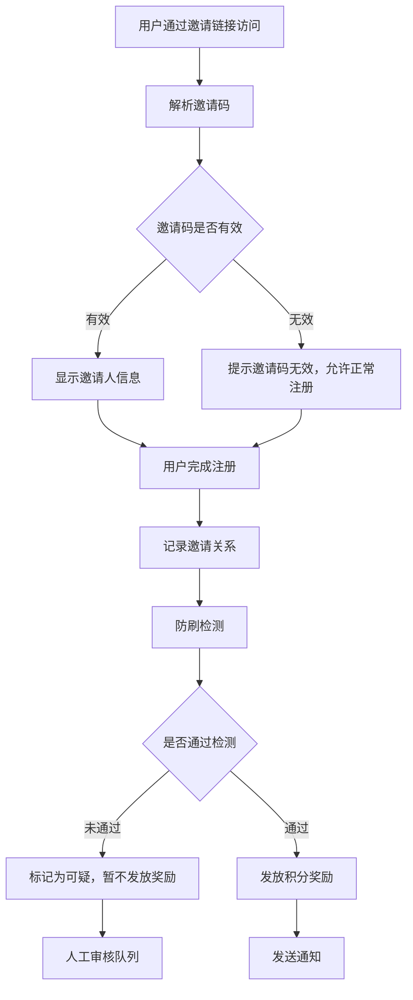
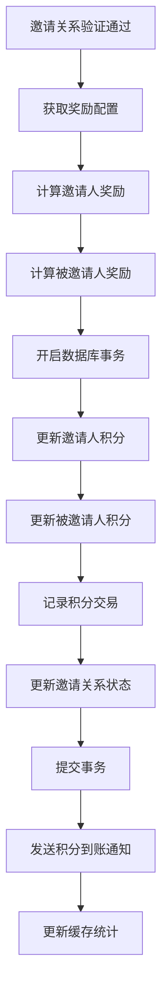

# 设计文档

## 概述

本文档描述了 Aibrary 用户邀请好友注册送积分系统的技术设计方案。该系统将集成到现有的 Strapi CMS 架构中，与现有的用户系统、积分系统和通知系统无缝集成。设计重点关注防刷机制、性能优化和数据安全。

## 架构

### 系统架构图



### 服务划分

1. **邀请码管理服务**：生成、验证和管理邀请码
2. **邀请关系服务**：记录和查询用户邀请关系
3. **积分奖励服务**：处理邀请成功后的积分发放
4. **防刷检测服务**：检测异常邀请行为和防刷机制
5. **统计分析服务**：生成邀请数据统计和分析报告

## 组件和接口

### 1. 数据模型扩展

#### 扩展用户模型 (users-permissions.user)

```typescript
// 新增字段
interface UserExtension {
  // 邀请信息
  inviteCode: string | null; // 用户的专属邀请码
  invitedBy: Relation<'plugin::users-permissions.user'> | null; // 邀请人
  invitedAt: Date | null; // 被邀请注册时间
  
  // 邀请统计
  inviteCount: number; // 成功邀请人数
  inviteCreditsEarned: number; // 通过邀请获得的积分总数
}
```

### 2. 新增内容类型

#### InviteCode（邀请码）

```typescript
interface InviteCode {
  code: string; // 邀请码
  user: Relation<'plugin::users-permissions.user'>; // 邀请人
  isActive: boolean; // 是否有效
  expiresAt: Date | null; // 过期时间
  usageCount: number; // 使用次数
  maxUsage: number | null; // 最大使用次数
  createdAt: Date;
  updatedAt: Date;
}
```

#### InviteRelation（邀请关系）

```typescript
interface InviteRelation {
  inviter: Relation<'plugin::users-permissions.user'>; // 邀请人
  invitee: Relation<'plugin::users-permissions.user'>; // 被邀请人
  inviteCode: string; // 使用的邀请码
  status: 'pending' | 'completed' | 'invalid'; // 状态
  inviteRewardGiven: boolean; // 邀请人奖励是否已发放
  inviteeRewardGiven: boolean; // 被邀请人奖励是否已发放
  inviterRewardAmount: number; // 邀请人获得积分
  inviteeRewardAmount: number; // 被邀请人获得积分
  registrationIp: string; // 注册IP地址
  registrationDevice: string; // 注册设备标识
  createdAt: Date;
  verifiedAt: Date | null; // 验证完成时间
}
```

#### InviteConfig（邀请配置）

```typescript
interface InviteConfig {
  key: string; // 配置键
  value: any; // 配置值
  description: string; // 配置说明
  isActive: boolean; // 是否启用
  updatedBy: Relation<'plugin::users-permissions.user'>; // 更新人
  updatedAt: Date;
}
```

#### InviteLog（邀请日志）

```typescript
interface InviteLog {
  user: Relation<'plugin::users-permissions.user'>; // 相关用户
  action: 'invite_generated' | 'invite_used' | 'reward_given' | 'suspicious_detected'; // 操作类型
  details: Record<string, any>; // 详细信息
  ipAddress: string; // IP地址
  userAgent: string; // 用户代理
  createdAt: Date;
}
```

### 3. API 接口设计

#### 邀请码管理 API

```typescript
// GET /api/users/me/invite-code
// 获取用户的邀请码，如不存在则生成
interface InviteCodeResponse {
  code: string;
  link: string; // 完整的邀请链接
  usage: {
    count: number;
    maxUsage: number | null;
  };
  expiresAt: Date | null;
}

// POST /api/invite-codes/generate
// 重新生成邀请码
{
  force?: boolean; // 是否强制重新生成
}

// GET /api/invite-codes/validate/:code
// 验证邀请码有效性
interface ValidateResponse {
  valid: boolean;
  inviter?: {
    username: string;
    avatar?: string;
  };
  message?: string;
}
```

#### 邀请关系 API

```typescript
// POST /api/invites/register
// 被邀请用户注册时调用
{
  inviteCode: string;
  userId: number; // 新注册的用户ID
}

// GET /api/users/me/invites
// 获取用户的邀请记录
interface InviteStatsResponse {
  totalInvites: number;
  completedInvites: number;
  pendingInvites: number;
  totalCreditsEarned: number;
  recentInvites: {
    id: number;
    registeredAt: Date;
    status: string;
    creditsEarned: number;
  }[];
}

// GET /api/users/me/invited-by
// 获取当前用户的邀请来源
interface InvitedByResponse {
  inviter?: {
    username: string;
    invitedAt: Date;
  };
  rewards: {
    received: boolean;
    amount: number;
  };
}
```

#### 统计分析 API

```typescript
// GET /api/admin/invite-stats
// 管理员获取邀请统计
interface AdminStatsResponse {
  overview: {
    totalUsers: number;
    invitedUsers: number;
    inviteConversionRate: number;
    totalCreditsGiven: number;
  };
  trends: {
    date: string;
    newInvites: number;
    completedInvites: number;
  }[];
  topInviters: {
    username: string;
    inviteCount: number;
    creditsEarned: number;
  }[];
}
```

### 4. 服务接口

#### InviteCodeService

```typescript
interface InviteCodeService {
  // 生成邀请码
  generateInviteCode(userId: number, force?: boolean): Promise<InviteCode>;
  
  // 验证邀请码
  validateInviteCode(code: string): Promise<{valid: boolean; inviteCode?: InviteCode}>;
  
  // 获取邀请码统计
  getInviteCodeStats(userId: number): Promise<InviteCodeStats>;
  
  // 检查邀请码是否过期
  checkExpiration(): Promise<void>;
}
```

#### InviteRelationService

```typescript
interface InviteRelationService {
  // 创建邀请关系
  createInviteRelation(inviteCode: string, inviteeId: number, metadata: any): Promise<InviteRelation>;
  
  // 处理邀请完成
  completeInvitation(relationId: number): Promise<void>;
  
  // 获取用户邀请记录
  getUserInvites(userId: number, status?: string): Promise<InviteRelation[]>;
  
  // 检查邀请关系是否有效
  validateInviteRelation(inviterId: number, inviteeId: number): Promise<boolean>;
}
```

#### InviteRewardService

```typescript
interface InviteRewardService {
  // 发放邀请奖励
  grantInviteRewards(relationId: number): Promise<void>;
  
  // 计算奖励金额
  calculateRewardAmount(type: 'inviter' | 'invitee'): Promise<number>;
  
  // 批量处理奖励
  processPendingRewards(): Promise<void>;
  
  // 回收异常奖励
  revokeInvalidRewards(relationIds: number[]): Promise<void>;
}
```

#### AntiFraudService

```typescript
interface AntiFraudService {
  // 检测可疑注册
  detectSuspiciousRegistration(metadata: RegistrationMetadata): Promise<SuspiciousLevel>;
  
  // 检查IP限制
  checkIpRestriction(ip: string): Promise<boolean>;
  
  // 检查设备限制
  checkDeviceRestriction(deviceId: string): Promise<boolean>;
  
  // 标记可疑行为
  markSuspiciousActivity(userId: number, reason: string): Promise<void>;
  
  // 获取风险评估
  getRiskAssessment(userId: number): Promise<RiskLevel>;
}
```

## 数据模型

### 数据库模式

```sql
-- 邀请码表
CREATE TABLE invite_codes (
  id INT PRIMARY KEY AUTO_INCREMENT,
  documentId VARCHAR(255) UNIQUE,
  code VARCHAR(20) NOT NULL UNIQUE,
  user_id INT NOT NULL,
  is_active BOOLEAN DEFAULT true,
  expires_at TIMESTAMP NULL,
  usage_count INT DEFAULT 0,
  max_usage INT NULL,
  created_at TIMESTAMP DEFAULT CURRENT_TIMESTAMP,
  updated_at TIMESTAMP DEFAULT CURRENT_TIMESTAMP ON UPDATE CURRENT_TIMESTAMP,
  FOREIGN KEY (user_id) REFERENCES up_users(id),
  INDEX idx_code (code),
  INDEX idx_user_active (user_id, is_active)
);

-- 邀请关系表
CREATE TABLE invite_relations (
  id INT PRIMARY KEY AUTO_INCREMENT,
  documentId VARCHAR(255) UNIQUE,
  inviter_id INT NOT NULL,
  invitee_id INT NOT NULL,
  invite_code VARCHAR(20) NOT NULL,
  status ENUM('pending', 'completed', 'invalid') DEFAULT 'pending',
  invite_reward_given BOOLEAN DEFAULT false,
  invitee_reward_given BOOLEAN DEFAULT false,
  inviter_reward_amount INT DEFAULT 0,
  invitee_reward_amount INT DEFAULT 0,
  registration_ip VARCHAR(45),
  registration_device VARCHAR(255),
  created_at TIMESTAMP DEFAULT CURRENT_TIMESTAMP,
  verified_at TIMESTAMP NULL,
  FOREIGN KEY (inviter_id) REFERENCES up_users(id),
  FOREIGN KEY (invitee_id) REFERENCES up_users(id),
  UNIQUE KEY unique_invitee (invitee_id),
  INDEX idx_inviter (inviter_id),
  INDEX idx_status (status),
  INDEX idx_created_at (created_at)
);

-- 邀请配置表
CREATE TABLE invite_configs (
  id INT PRIMARY KEY AUTO_INCREMENT,
  documentId VARCHAR(255) UNIQUE,
  config_key VARCHAR(100) NOT NULL UNIQUE,
  config_value JSON NOT NULL,
  description TEXT,
  is_active BOOLEAN DEFAULT true,
  updated_by INT,
  updated_at TIMESTAMP DEFAULT CURRENT_TIMESTAMP ON UPDATE CURRENT_TIMESTAMP,
  FOREIGN KEY (updated_by) REFERENCES up_users(id)
);

-- 邀请日志表
CREATE TABLE invite_logs (
  id INT PRIMARY KEY AUTO_INCREMENT,
  documentId VARCHAR(255) UNIQUE,
  user_id INT,
  action VARCHAR(50) NOT NULL,
  details JSON,
  ip_address VARCHAR(45),
  user_agent TEXT,
  created_at TIMESTAMP DEFAULT CURRENT_TIMESTAMP,
  FOREIGN KEY (user_id) REFERENCES up_users(id),
  INDEX idx_user_action (user_id, action),
  INDEX idx_created_at (created_at)
);

-- 扩展用户表
ALTER TABLE up_users 
ADD COLUMN invite_code VARCHAR(20) NULL,
ADD COLUMN invited_by INT NULL,
ADD COLUMN invited_at TIMESTAMP NULL,
ADD COLUMN invite_count INT DEFAULT 0,
ADD COLUMN invite_credits_earned INT DEFAULT 0,
ADD FOREIGN KEY (invited_by) REFERENCES up_users(id),
ADD INDEX idx_invite_code (invite_code),
ADD INDEX idx_invited_by (invited_by);
```

### Redis 缓存结构

```typescript
// 邀请码缓存
`invite_code:${code}` = {
  userId: number;
  isActive: boolean;
  expiresAt: timestamp;
  usageCount: number;
}

// 用户邀请统计缓存
`user:${userId}:invite_stats` = {
  totalInvites: number;
  completedInvites: number;
  totalCreditsEarned: number;
  lastUpdated: timestamp;
}

// IP地址注册限制缓存
`ip_limit:${ip}:${date}` = {
  count: number;
  firstRegistration: timestamp;
}

// 设备注册限制缓存
`device_limit:${deviceId}` = {
  registrationCount: number;
  firstRegistration: timestamp;
  lastRegistration: timestamp;
}

// 防刷检测缓存
`antifraud:user:${userId}` = {
  riskLevel: 'low' | 'medium' | 'high';
  suspiciousCount: number;
  lastCheck: timestamp;
}
```

## 核心场景

### 邀请码生成流程



### 邀请注册流程



### 积分奖励发放流程



## 防刷机制设计

### 多维度检测

1. **IP地址检测**
   - 同一IP每日注册限制：最多5个
   - 短时间内（1小时）注册限制：最多2个
   - 记录IP地址历史行为模式

2. **设备指纹检测**
   - 同一设备标识只能注册一次
   - 基于浏览器指纹识别相似设备
   - 检测虚拟机和模拟器环境

3. **用户行为检测**
   - 注册后立即活跃度检测
   - 账号信息完整度检测
   - 登录频率和使用模式分析

4. **邀请模式检测**
   - 单个用户每日邀请成功上限：50人
   - 短时间内大量邀请检测
   - 异常邀请成功率检测

### 风险评估模型

```typescript
interface RiskAssessment {
  riskLevel: 'low' | 'medium' | 'high';
  riskFactors: {
    ipReputation: number; // IP声誉分数
    deviceTrust: number; // 设备信任度
    behaviorPattern: number; // 行为模式分数
    invitePattern: number; // 邀请模式分数
  };
  actions: string[]; // 建议采取的行动
}
```

## 错误处理

### 错误类型定义

```typescript
enum InviteErrorCode {
  INVALID_INVITE_CODE = 'INVALID_INVITE_CODE',
  EXPIRED_INVITE_CODE = 'EXPIRED_INVITE_CODE',
  SELF_INVITE_NOT_ALLOWED = 'SELF_INVITE_NOT_ALLOWED',
  ALREADY_INVITED = 'ALREADY_INVITED',
  INVITE_LIMIT_EXCEEDED = 'INVITE_LIMIT_EXCEEDED',
  SUSPICIOUS_ACTIVITY = 'SUSPICIOUS_ACTIVITY',
  REWARD_ALREADY_GIVEN = 'REWARD_ALREADY_GIVEN',
}
```

### 错误处理策略

1. **邀请码相关错误**
   - 无效邀请码：提示错误但允许正常注册
   - 过期邀请码：提示过期并建议联系邀请人
   - 重复使用：根据配置决定是否允许

2. **防刷检测错误**
   - 可疑活动：暂停奖励发放，加入审核队列
   - IP限制：提示过于频繁，建议稍后再试
   - 设备限制：提示设备已注册，建议使用其他设备

3. **系统错误**
   - 数据库异常：回滚事务，记录错误日志
   - 积分发放失败：重试机制，超时后人工处理
   - 通知发送失败：异步重试，记录失败日志

## 性能优化

### 缓存策略

1. **邀请码缓存**
   - 热点邀请码缓存到Redis，TTL 1小时
   - 预加载活跃用户的邀请码
   - 使用布隆过滤器快速判断邀请码存在性

2. **统计数据缓存**
   - 用户邀请统计缓存，TTL 30分钟
   - 全局统计数据缓存，TTL 1小时
   - 使用计数器缓存避免频繁数据库查询

3. **防刷检测缓存**
   - IP和设备限制使用Redis计数器
   - 设置合理的TTL避免误拦截
   - 使用分布式锁防止并发问题

### 数据库优化

1. **索引优化**
   - 为查询频繁的字段创建合适索引
   - 复合索引优化复杂查询
   - 定期分析慢查询并优化

2. **分区策略**
   - 按时间分区历史数据
   - 归档旧的邀请记录和日志
   - 使用读写分离减轻主库压力

## 监控和告警

### 关键指标监控

1. **业务指标**
   - 每日新增邀请数
   - 邀请转化率
   - 积分发放量
   - 异常行为检测率

2. **技术指标**
   - API响应时间
   - 数据库查询性能
   - 缓存命中率
   - 错误率和异常数量

3. **安全指标**
   - 可疑注册数量
   - IP和设备拦截数量
   - 风险用户数量
   - 积分回收情况

### 告警机制

1. **业务告警**
   - 邀请转化率异常下降
   - 大量相同IP注册
   - 积分发放异常增长

2. **技术告警**
   - API响应时间超阈值
   - 数据库连接异常
   - 缓存服务不可用

3. **安全告警**
   - 检测到大规模刷单行为
   - 系统遭受恶意攻击
   - 数据异常访问