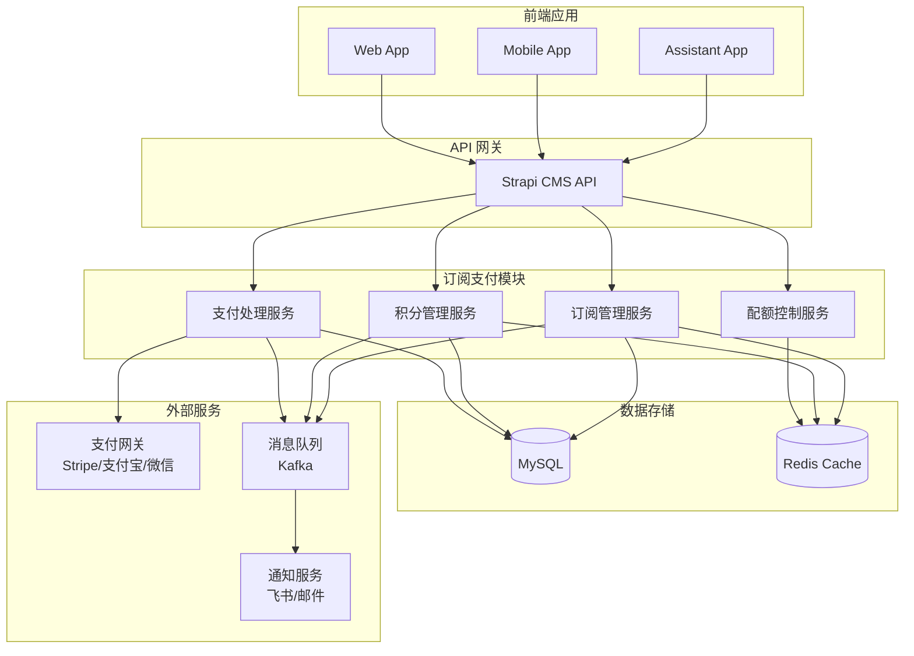

# 设计文档

## 概述

本文档描述了 Aibrary 订阅支付系统的技术设计方案。该系统将集成到现有的 Strapi CMS 架构中，提供用户订阅管理、积分系统、支付处理和权限控制功能。设计充分利用现有的基础设施（Redis、Kafka、用户权限系统），确保与现有功能的无缝集成。

## 架构

### 系统架构图



### 服务划分

1. **订阅管理服务**：处理订阅创建、续费、取消、状态管理
2. **积分管理服务**：处理积分充值、消费、余额查询、交易记录
3. **支付处理服务**：集成支付网关、处理支付回调、退款管理
4. **配额控制服务**：实时检查和更新用户使用配额

## 组件和接口

### 1. 数据模型扩展

#### 扩展用户模型 (users-permissions.user)

```typescript
// 新增字段
interface UserExtension {
  // 订阅信息
  subscriptionTier: 'free' | 'weekly' | 'monthly' | 'quarterly' | 'yearly';
  subscriptionExpiry: Date | null;
  subscriptionStatus: 'active' | 'expired' | 'cancelled' | 'pending';

  // 积分信息
  credits: number;
  creditsExpiry: Date | null; // 可选：积分过期时间

  // 使用配额（缓存在 Redis，定期同步到数据库）
  dailyBookQuota: number;
  dailyChatQuota: number;
  lastQuotaReset: Date;

  // 支付信息
  stripeCustomerId?: string;
  preferredPaymentMethod?: string;
}
```

### 2. 新增内容类型

#### SubscriptionPlan（订阅计划）

```typescript
interface SubscriptionPlan {
  name: string;
  code: 'weekly' | 'monthly' | 'quarterly' | 'yearly';
  price: number;
  currency: string;
  duration: number; // 天数
  benefits: {
    unlimitedBooks: boolean;
    unlimitedChat: boolean;
    monthlyCredits: number;
    customBenefits?: string[];
  };
  isActive: boolean;
  stripeProductId?: string;
  stripePriceId?: string;
}
```

#### CreditPackage（积分包）

```typescript
interface CreditPackage {
  name: string;
  credits: number;
  price: number;
  currency: string;
  bonus?: number; // 赠送积分
  isActive: boolean;
  stripeProductId?: string;
  stripePriceId?: string;
}
```

#### Transaction（交易记录）

```typescript
interface Transaction {
  user: Relation<'plugin::users-permissions.user'>;
  type: 'subscription' | 'credit_purchase' | 'credit_usage' | 'credit_grant';
  amount: number;
  currency?: string;
  credits?: number;
  description: string;
  status: 'pending' | 'completed' | 'failed' | 'refunded';
  paymentMethod?: string;
  paymentIntentId?: string;
  metadata: Record<string, any>;
  createdAt: Date;
}
```

#### UserQuota（用户配额）

```typescript
interface UserQuota {
  user: Relation<'plugin::users-permissions.user'>;
  date: Date;
  bookViews: number;
  chatRounds: number;
  voiceClones: number;
  audioGenerations: number;
}
```

### 3. API 接口设计

#### 订阅管理 API

```typescript
// GET /api/subscription-plans
// 获取所有可用订阅计划

// GET /api/users/me/subscription
// 获取当前用户订阅信息

// POST /api/subscriptions/create
{
  planCode: string;
  paymentMethodId?: string;
}

// POST /api/subscriptions/cancel
// 取消订阅（期末生效）

// POST /api/subscriptions/resume
// 恢复已取消的订阅
```

#### 积分管理 API

```typescript
// GET /api/credit-packages
// 获取所有积分包

// GET /api/users/me/credits
// 获取用户积分余额和历史

// POST /api/credits/purchase
{
  packageId: string;
  paymentMethodId?: string;
}

// POST /api/credits/use
{
  amount: number;
  purpose: 'voice_clone' | 'audio_generation';
  metadata?: Record<string, any>;
}
```

#### 配额管理 API

```typescript
// GET /api/users/me/quota
// 获取当前用户今日配额使用情况

// POST /api/quota/check
{
  resource: 'book' | 'chat';
  amount?: number;
}
```

### 4. 服务接口

#### SubscriptionService

```typescript
interface SubscriptionService {
  // 创建订阅
  createSubscription(userId: string, planCode: string, paymentMethodId?: string): Promise<Subscription>;

  // 更新订阅状态
  updateSubscriptionStatus(userId: string): Promise<void>;

  // 处理订阅续费
  processRenewal(subscriptionId: string): Promise<void>;

  // 取消订阅
  cancelSubscription(userId: string, immediate?: boolean): Promise<void>;

  // 检查订阅权限
  checkSubscriptionAccess(userId: string, feature: string): Promise<boolean>;
}
```

#### CreditService

```typescript
interface CreditService {
  // 充值积分
  addCredits(userId: string, amount: number, source: string): Promise<void>;

  // 消费积分
  useCredits(userId: string, amount: number, purpose: string): Promise<boolean>;

  // 获取积分余额
  getBalance(userId: string): Promise<number>;

  // 每月赠送积分
  grantMonthlyCredits(): Promise<void>;
}
```

#### QuotaService

```typescript
interface QuotaService {
  // 检查配额
  checkQuota(userId: string, resource: string, amount?: number): Promise<boolean>;

  // 消费配额
  consumeQuota(userId: string, resource: string, amount?: number): Promise<void>;

  // 重置每日配额
  resetDailyQuotas(): Promise<void>;

  // 获取配额使用情况
  getQuotaUsage(userId: string): Promise<QuotaUsage>;
}
```

## 数据模型

### 数据库模式

```sql
-- 订阅计划表
CREATE TABLE subscription_plans (
  id INT PRIMARY KEY AUTO_INCREMENT,
  documentId VARCHAR(255) UNIQUE,
  name VARCHAR(255) NOT NULL,
  code VARCHAR(50) NOT NULL,
  price DECIMAL(10, 2) NOT NULL,
  currency VARCHAR(3) DEFAULT 'USD',
  duration INT NOT NULL, -- 天数
  benefits JSON NOT NULL,
  is_active BOOLEAN DEFAULT true,
  stripe_product_id VARCHAR(255),
  stripe_price_id VARCHAR(255),
  created_at TIMESTAMP DEFAULT CURRENT_TIMESTAMP,
  updated_at TIMESTAMP DEFAULT CURRENT_TIMESTAMP ON UPDATE CURRENT_TIMESTAMP
);

-- 积分包表
CREATE TABLE credit_packages (
  id INT PRIMARY KEY AUTO_INCREMENT,
  documentId VARCHAR(255) UNIQUE,
  name VARCHAR(255) NOT NULL,
  credits INT NOT NULL,
  price DECIMAL(10, 2) NOT NULL,
  currency VARCHAR(3) DEFAULT 'USD',
  bonus INT DEFAULT 0,
  is_active BOOLEAN DEFAULT true,
  stripe_product_id VARCHAR(255),
  stripe_price_id VARCHAR(255),
  created_at TIMESTAMP DEFAULT CURRENT_TIMESTAMP,
  updated_at TIMESTAMP DEFAULT CURRENT_TIMESTAMP ON UPDATE CURRENT_TIMESTAMP
);

-- 交易记录表
CREATE TABLE transactions (
  id INT PRIMARY KEY AUTO_INCREMENT,
  documentId VARCHAR(255) UNIQUE,
  user_id INT NOT NULL,
  type ENUM('subscription', 'credit_purchase', 'credit_usage', 'credit_grant') NOT NULL,
  amount DECIMAL(10, 2),
  currency VARCHAR(3),
  credits INT,
  description TEXT,
  status ENUM('pending', 'completed', 'failed', 'refunded') DEFAULT 'pending',
  payment_method VARCHAR(50),
  payment_intent_id VARCHAR(255),
  metadata JSON,
  created_at TIMESTAMP DEFAULT CURRENT_TIMESTAMP,
  FOREIGN KEY (user_id) REFERENCES up_users(id)
);

-- 用户配额表
CREATE TABLE user_quotas (
  id INT PRIMARY KEY AUTO_INCREMENT,
  documentId VARCHAR(255) UNIQUE,
  user_id INT NOT NULL,
  date DATE NOT NULL,
  book_views INT DEFAULT 0,
  chat_rounds INT DEFAULT 0,
  voice_clones INT DEFAULT 0,
  audio_generations INT DEFAULT 0,
  created_at TIMESTAMP DEFAULT CURRENT_TIMESTAMP,
  updated_at TIMESTAMP DEFAULT CURRENT_TIMESTAMP ON UPDATE CURRENT_TIMESTAMP,
  UNIQUE KEY unique_user_date (user_id, date),
  FOREIGN KEY (user_id) REFERENCES up_users(id)
);
```

### Redis 缓存结构

```typescript
// 用户订阅状态缓存
`user:${userId}:subscription` = {
  tier: string;
  expiry: timestamp;
  status: string;
}

// 用户积分余额缓存
`user:${userId}:credits` = number;

// 用户每日配额缓存
`user:${userId}:quota:${date}` = {
  bookViews: number;
  chatRounds: number;
  lastReset: timestamp;
}

// 配置缓存
`config:free_user_limits` = {
  dailyBooks: number;
  dailyChats: number;
  monthlyCredits: number;
}
```

## 错误处理

### 错误类型定义

```typescript
enum PaymentErrorCode {
  INSUFFICIENT_FUNDS = 'INSUFFICIENT_FUNDS',
  CARD_DECLINED = 'CARD_DECLINED',
  INVALID_PAYMENT_METHOD = 'INVALID_PAYMENT_METHOD',
  SUBSCRIPTION_ALREADY_EXISTS = 'SUBSCRIPTION_ALREADY_EXISTS',
  INVALID_PLAN = 'INVALID_PLAN',
}

enum QuotaErrorCode {
  QUOTA_EXCEEDED = 'QUOTA_EXCEEDED',
  INSUFFICIENT_CREDITS = 'INSUFFICIENT_CREDITS',
  FEATURE_NOT_AVAILABLE = 'FEATURE_NOT_AVAILABLE',
}
```

### 错误处理策略

1. **支付失败**
   - 记录失败原因
   - 发送通知给用户
   - 提供重试机制
   - 3天宽限期后降级服务

2. **配额超限**
   - 返回明确的错误信息
   - 提供升级建议
   - 记录超限事件

3. **系统错误**
   - 回滚事务
   - 记录详细日志
   - 降级到默认行为
   - 通知运维团队

## 测试策略

### 单元测试

1. **服务层测试**
   - 订阅创建/更新/取消逻辑
   - 积分充值/消费计算
   - 配额检查和重置逻辑

2. **工具函数测试**
   - 日期计算（订阅到期、配额重置）
   - 价格计算（含税、汇率转换）
   - 权限判断逻辑

### 集成测试

1. **API 端点测试**
   - 认证和授权
   - 参数验证
   - 响应格式

2. **支付流程测试**
   - Webhook 处理
   - 支付状态同步
   - 退款流程

3. **缓存一致性测试**
   - Redis 与数据库同步
   - 缓存失效场景
   - 并发更新处理

### 性能测试

1. **负载测试**
   - 配额检查接口（高频调用）
   - 积分余额查询
   - 订阅状态验证

2. **压力测试**
   - 并发支付处理
   - 批量配额重置
   - 大量用户同时在线

### 安全测试

1. **支付安全**
   - PCI DSS 合规性
   - 支付信息加密
   - 防重复支付

2. **权限测试**
   - 越权访问防护
   - API 限流
   - SQL 注入防护
