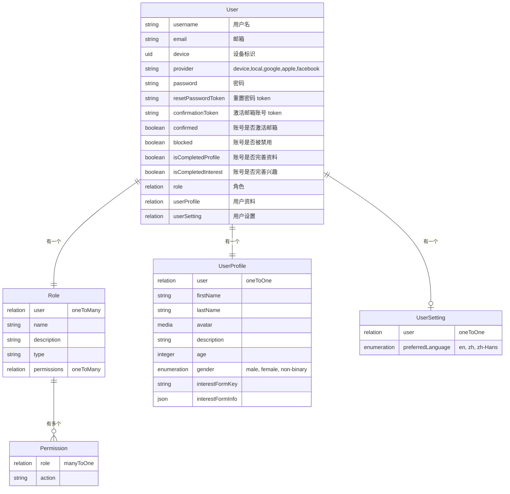
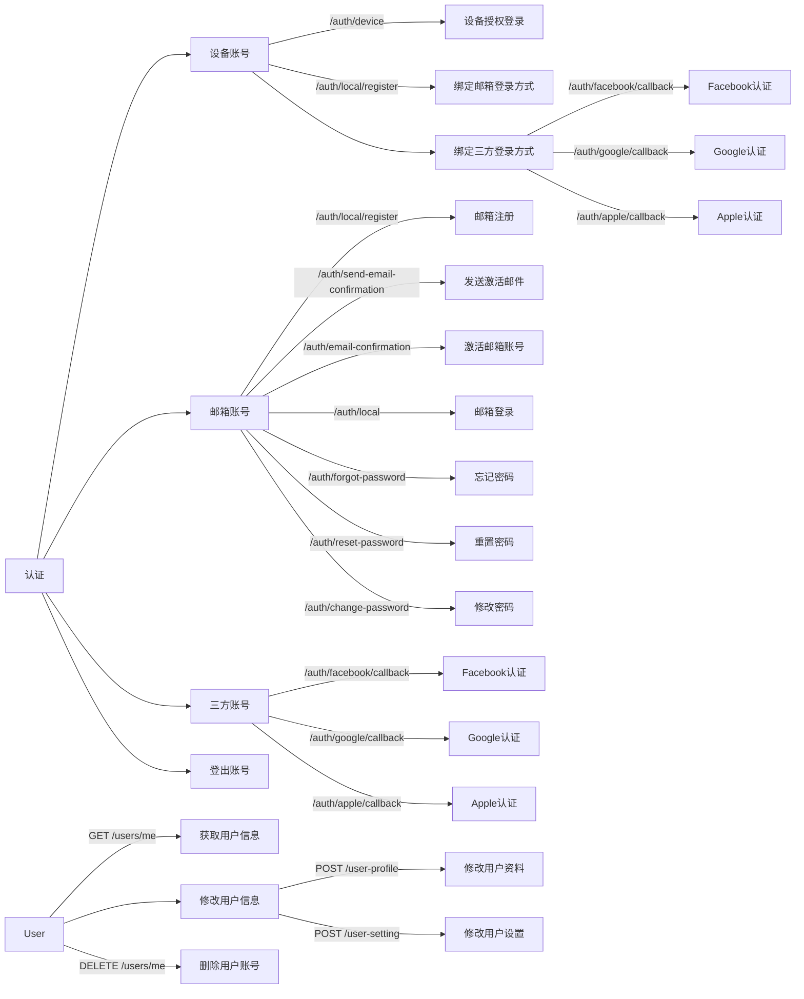
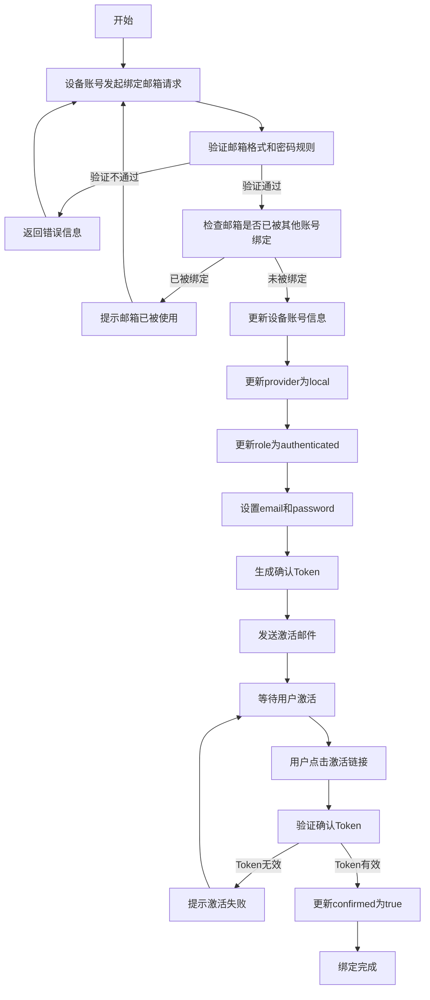
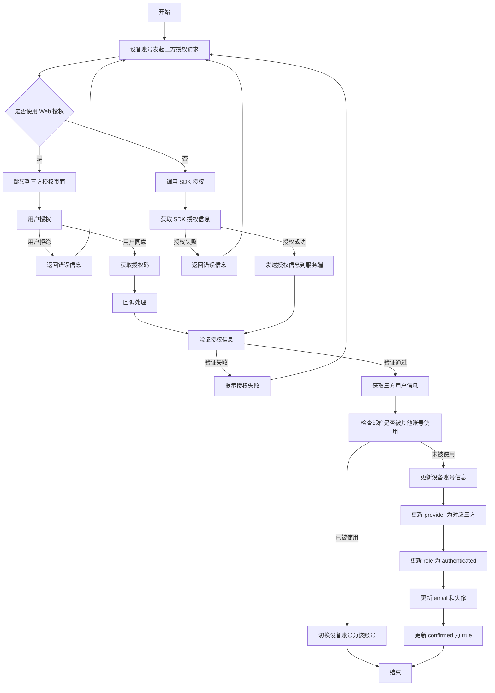
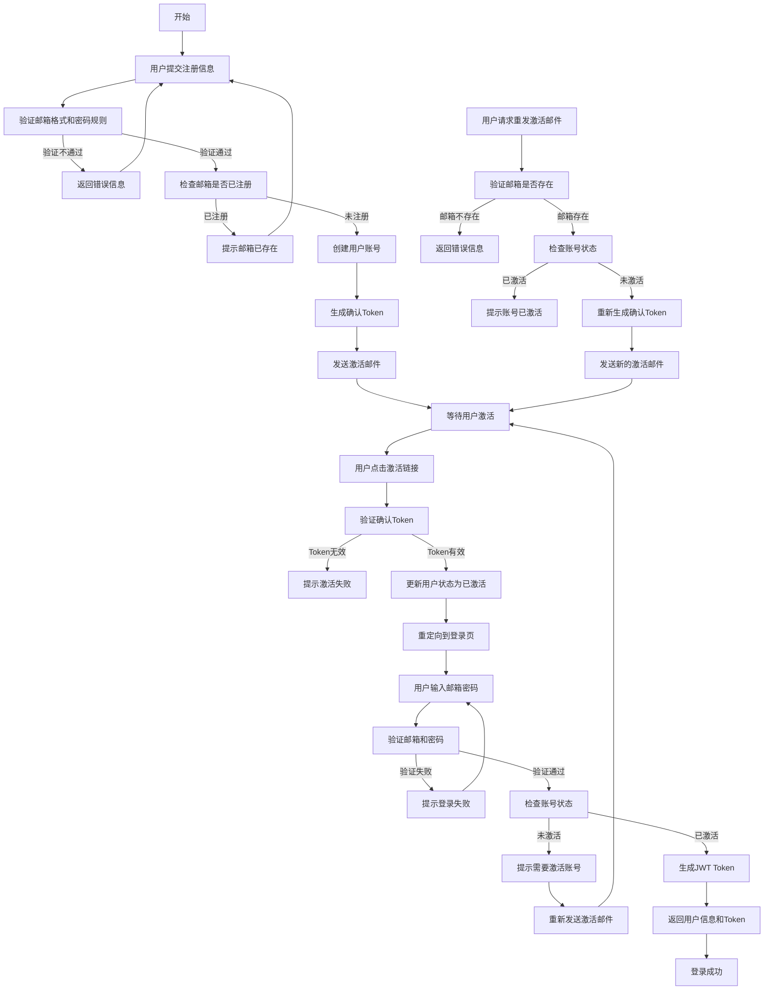
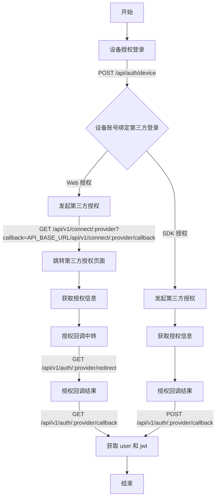

## 用户域

### ER 图



### 用例图



### Schema 设计

#### User

```JSON
{
  "kind": "collectionType",
  "collectionName": "up_users",
  "info": {
    "name": "user",
    "description": "",
    "singularName": "user",
    "pluralName": "users",
    "displayName": "User"
  },
  "options": {
    "draftAndPublish": false
  },
  "attributes": {
    "username": {
      "type": "string",
      "minLength": 3,
      "unique": true,
      "configurable": false,
      "required": true
    },
    "email": {
      "type": "email",
      "minLength": 6,
      "configurable": false,
      "required": true
    },
    "device": {
      "type": "uid",
      "configurable": false
    },
    "provider": {
      "type": "string",
      "configurable": false,
      "hidden": false
    },
    "password": {
      "type": "password",
      "minLength": 6,
      "configurable": false,
      "private": true,
      "searchable": false
    },
    "resetPasswordToken": {
      "type": "string",
      "configurable": false,
      "private": true,
      "searchable": false
    },
    "confirmationToken": {
      "type": "string",
      "configurable": false,
      "private": true,
      "searchable": false
    },
    "confirmed": {
      "type": "boolean",
      "default": false,
      "configurable": false
    },
    "blocked": {
      "type": "boolean",
      "default": false,
      "configurable": false
    },
    "role": {
      "type": "relation",
      "relation": "manyToOne",
      "target": "plugin::users-permissions.role",
      "inversedBy": "users",
      "configurable": false
    },
    "isCompletedProfile": {
      "type": "boolean",
      "default": false
    },
    "isCompletedInterest": {
      "type": "boolean",
      "default": false
    },
    "userProfile": {
      "type": "relation",
      "relation": "oneToOne",
      "target": "api::user-profile.user-profile",
      "inversedBy": "user"
    },
    "userSetting": {
      "type": "relation",
      "relation": "oneToOne",
      "target": "api::user-setting.user-setting",
      "inversedBy": "user"
    }
  }
}
```

#### UserProfile

```json
{
  "kind": "collectionType",
  "collectionName": "user_profiles",
  "info": {
    "singularName": "user-profile",
    "pluralName": "user-profiles",
    "displayName": "UserProfile"
  },
  "options": {
    "draftAndPublish": false
  },
  "attributes": {
    "user": {
      "type": "relation",
      "relation": "oneToOne",
      "target": "plugin::users-permissions.user",
      "mappedBy": "userProfile"
    },
    "firstName": {
      "type": "string"
    },
    "lastName": {
      "type": "string"
    },
    "avatar": {
      "type": "media",
      "multiple": false,
      "required": false,
      "allowedTypes": ["images"]
    },
    "age": {
      "type": "integer",
      "min": 0
    },
    "gender": {
      "type": "enumeration",
      "enum": ["male", "female", "non-binary"]
    },
    "elevation": {
      "type": "enumeration",
      "enum": [
        "Emotions",
        "Motivation",
        "Nutrition",
        "Habits",
        "Self-confidence",
        "Mindset",
        "Self-care",
        "Exercise",
        "Empathy",
        "Love&Relationships",
        "Personal Finance",
        "Creativity",
        "Innovation",
        "Leadership",
        "Technology"
      ]
    },
    "toipics": {
      "type": "enumeration",
      "enum": [
        "Steve Jobs",
        "Richard Branson",
        "LeBron James",
        "Opera Winfrey",
        "Emma Watson",
        "Serena Williams",
        "Jeff Bezos",
        "Kevin Hart",
        "Brene Brown"
      ]
    },
    "interestFormKey": {
      "type": "string"
    },
    "interestFormInfo": {
      "type": "json"
    }
  }
}
```

#### UserSetting

```json
{
  "kind": "collectionType",
  "collectionName": "user_settings",
  "info": {
    "singularName": "user-setting",
    "pluralName": "user-settings",
    "displayName": "UserSetting"
  },
  "options": {
    "draftAndPublish": false
  },
  "attributes": {
    "user": {
      "type": "relation",
      "relation": "oneToOne",
      "target": "plugin::users-permissions.user",
      "mappedBy": "userSetting"
    },
    "preferredLanguage": {
      "type": "enumeration",
      "enum": ["en", "zh", "zh-Hans"]
    }
  }
}
```

### 核心场景

#### 设备授权登录

1. 创建设备唯一标识（did）
2. 调用 `/api/auth/device` 接口注册/登录设备账号
3. 获取 JWT token 和用户信息

```typescript
// 设备注册/登录请求
POST / api / auth / device;
Body: {
  device: string; // 设备唯一标识
}

// 响应
Response: {
  data: {
    jwt: string; // JWT Token
    user: User; // 用户信息
  }
}
```

#### 账号绑定流程

设备账号可以绑定以下邮箱登录方式和三方登录方式：

#### 设备账号绑定邮箱登录方式

```typescript
POST /api/auth/local/register
Header: Authorization: Bearer Token
Body: {
  email: string;    // 邮箱
  password: string; // 密码
}
```



##### 设备账号绑定三方登录方式（Google/Facebook/Apple）

```typescript
// 发起第三方授权
GET /api/connect/[provider]
// 授权回调
GET /api/connect/[provider]/callback
// Web 登录
Header: Authorization: Bearer Token
GET /api/auth/[provider]/callback
// SDK 登录
Header: Authorization: Bearer Token
POST /api/auth/[provider]/callback
```

流程图



#### 邮箱注册流程

```typescript
POST / auth / local / register;
```

流程图



// 设备注册/登录请求
POST /api/auth/device

App 用网页授权
// 发起第三方授权
GET /api/connect/[provider]?callback=/api/connect/[provider]?callback=[API_BASE_URL]/api/auth/[provider]/redirect
// 授权回调
GET /api/connect/[provider]/callback
// Web 登录
Header: Authorization: Bearer Token

App 用 SDK 授权
Header: Authorization: Bearer Token
POST /api/auth/[provider]/callback



#### 权限控制

##### JWT Token

每次发送 API 请求时，服务器都会检查 Authorization 标头是否存在，并验证发出请求的用户是否有权访问资源。
要以用户身份发出 API 请求，请将 JWT 放入请求 Authorization 的标头中 GET。
任何没有 token 的请求都会默认拥有 public 角色权限。

##### 角色定义

- Public：未登录用户
- Authenticated：已登录用户，设备账号也属于已登录用户
- Subscribed：订阅用户

##### 权限配置

- 权限上 Public 有的，Authenticated、Subscribed 肯定有
- 权限范围 Subscribed > Authenticated > Public

##### 错误处理

- 401 Unauthorized：
  错误类型：UnauthorizedError
  错误原因：token 无效、token 失效
  处理逻辑：退回至启动页

- 403 Forbidden：
  错误类型：ForbiddenError。
  错误原因：该用户的角色没有接口权限。
  处理逻辑：提示用户当前操作无权限，或跳转到权限不足的提示页面。
