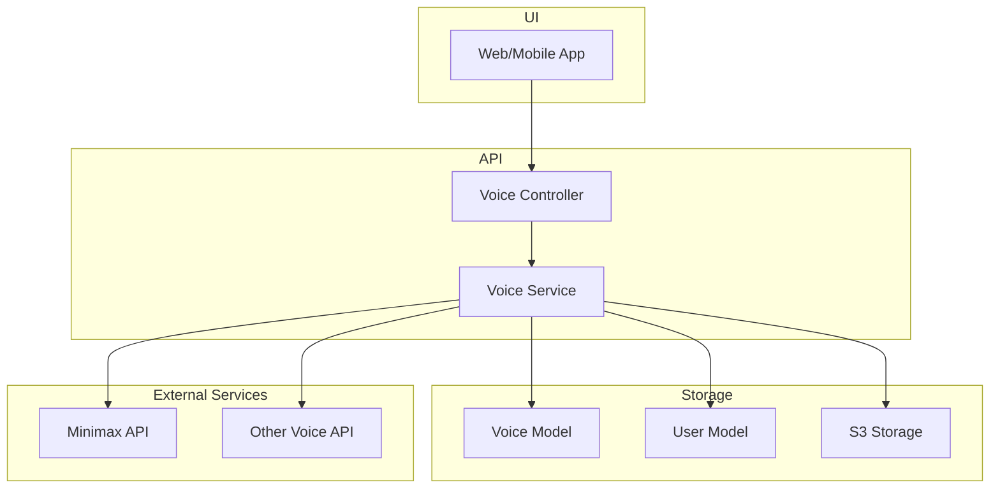
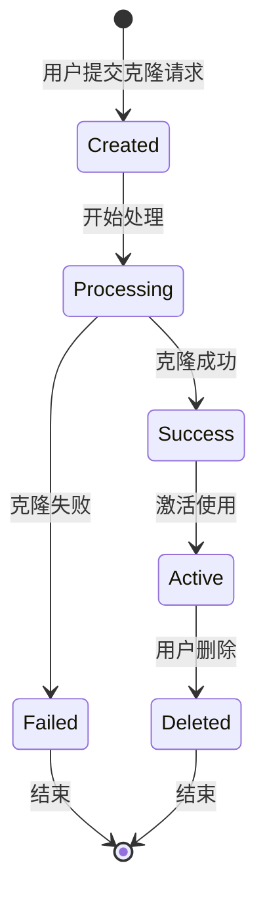

# 设计文档

## 概述

语音功能旨在为用户提供灵活的语音选择和播客生成能力。系统支持两种类型的语音：系统预设语音和用户克隆语音。通过集成现有的 Minimax 服务和其他语音提供商，用户可以创建个性化的音频内容。

### 技术栈

- **后端框架**: Strapi v5
- **数据库**: MySQL
- **语音服务**: Minimax API（主要）、Gemini、ElevenLabs、Fish 等
- **文件存储**: AWS S3
- **缓存**: Redis
- **认证**: Strapi Users & Permissions 插件

## 架构设计

### 系统架构图



## 组件和接口设计

### 1. Voice Content-Type（已存在）

基于现有的 schema.json，Voice 模型包含以下字段：

```typescript
interface Voice {
  documentId: string;
  voiceId: string; // 唯一标识符
  name: string; // 语音名称
  type: 'system' | 'user'; // 语音类型
  audio?: Media; // 音频样本
  cover?: Media; // 封面图片
  cloneStatus?: 'pending' | 'processing' | 'completed' | 'failed'; // 克隆状态
  description?: string; // 语音描述
  user?: User; // 关联用户（仅限用户语音）
  provider: 'minimax' | 'gemini' | 'elevenLabs' | 'fish' | 'other';
  isActive: boolean; // 是否可用
  sort: number; // 排序顺序
  language?: string; // 语音语言（如 zh-CN, en-US）
  gender?: 'male' | 'female' | 'neutral'; // 语音性别
  age?: 'child' | 'youth' | 'adult' | 'elder'; // 语音年龄段
  style?: string; // 语音风格（如 casual, formal, energetic）
}
```

### 2. API 接口设计

#### 基础 CRUD 操作（使用 Strapi 默认路由）

- `GET /api/voices` - 获取所有语音（系统语音 + 当前用户语音）
- `GET /api/voices/:id` - 获取语音详情
- `PUT /api/voices/:id` - 更新语音（仅更新自己的克隆语音）
- `DELETE /api/voices/:id` - 删除语音（仅删除自己的克隆语音）

注：系统语音的创建通过 Strapi CMS 管理界面完成，不提供 API 接口

#### 自定义路由（routes/custom.ts）

```typescript
// GET /api/user/voices - 获取当前用户的语音列表
{
  method: 'GET',
  path: '/user/voices',
  handler: 'voice.getUserVoices',
  config: {
    policies: [],
    middlewares: [],
  }
}

// POST /api/voices/clone - 用户克隆语音
{
  method: 'POST',
  path: '/voices/clone',
  handler: 'voice.cloneVoice',
  config: {
    policies: [],
    middlewares: [],
  }
}

```

### 3. 控制器设计

```typescript
// controllers/voice.ts
export default factories.createCoreController('api::voice.voice', ({ strapi }) => ({
  // 获取语音详情
  async findOne(ctx) {
    const { id } = ctx.params;
    const authUser = ctx.state.user;

    const voice = await strapi.service('api::voice.voice').findVoiceById(id, authUser?.id);

    if (!voice) {
      throw new errors.NotFoundError('语音不存在');
    }

    return this.transformResponse(voice);
  },

  // 获取用户语音列表
  async getUserVoices(ctx) {
    const authUser = ctx.state.user;
    if (!authUser) {
      return ctx.unauthorized();
    }

    const results = await strapi.service('api::voice.voice').findUserVoices(authUser.id);

    return this.transformResponse(results);
  },

  // 克隆语音
  async cloneVoice(ctx) {
    const authUser = ctx.state.user;
    if (!authUser) {
      return ctx.unauthorized();
    }

    const { audioFile, name, description } = ctx.request.body;

    const voice = await strapi.service('api::voice.voice').cloneUserVoice({
      userId: authUser.id,
      audioFile,
      name,
      description,
    });

    return this.transformResponse(voice);
  },
}));
```

### 4. 服务层设计

```typescript
// services/voice.ts
export default factories.createCoreService('api::voice.voice', ({ strapi }) => ({
  // 根据ID查找语音
  async findVoiceById(voiceId: string, userId?: number) {
    const filters: any = { documentId: voiceId };

    const results = await strapi.documents('api::voice.voice').findMany({
      filters,
      populate: ['audio', 'cover', 'user'],
      limit: 1,
    });

    if (results.length === 0) {
      return null;
    }

    const voice = results[0];

    // 如果是用户语音且不是当前用户的，则不返回
    if (voice.type === 'user' && voice.user?.id !== userId) {
      return null;
    }

    // 隐藏其他用户的敏感信息
    if (voice.type === 'user' && voice.user) {
      voice.user = {
        id: voice.user.id,
        username: voice.user.username,
        nickname: voice.user.nickname,
      };
    }

    return voice;
  },

  // 查找用户语音
  async findUserVoices(userId: number) {
    const results = await strapi.documents('api::voice.voice').findMany({
      filters: {
        user: { id: userId },
        type: 'user',
      },
      populate: ['audio', 'cover'],
      sort: { createdAt: 'desc' },
    });

    return results;
  },

  // 克隆用户语音
  async cloneUserVoice({ userId, audioFile, name, description }) {
    // 1. 检查用户语音限制
    const userVoiceCount = await this.getUserVoiceCount(userId);
    if (userVoiceCount >= 10) {
      throw new errors.ValidationError('用户语音数量已达上限');
    }

    // 2. 上传音频文件到 S3
    const uploadedFile = await strapi
      .plugin('upload')
      .service('upload')
      .upload({
        data: { fileInfo: { name: audioFile.name } },
        files: audioFile,
      });

    // 3. 调用 Minimax 服务进行语音克隆
    const minimaxService = strapi.service('api::common.minimax');
    const fileBuffer = await this.getFileBuffer(uploadedFile.id);

    const uploadResponse = await minimaxService.uploadVoice(fileBuffer, audioFile.name);
    const voiceId = `user_${userId}_${Date.now()}`;

    await minimaxService.cloneVoice({
      file_id: uploadResponse.file.file_id,
      voice_id: voiceId,
      text: '这是一个语音克隆测试',
    });

    // 4. 创建语音记录
    const voice = await strapi.documents('api::voice.voice').create({
      data: {
        voiceId,
        name,
        description,
        type: 'user',
        user: userId,
        provider: 'minimax',
        audio: uploadedFile.id,
        cloneStatus: 'processing', // 处理中
        isActive: false,
      },
    });

    // 5. 异步轮询克隆状态
    this.pollCloneStatus(voice.documentId);

    return voice;
  },

  // 辅助方法
  async getUserVoiceCount(userId: number) {
    const results = await strapi.documents('api::voice.voice').findMany({
      filters: {
        user: { id: userId },
        type: 'user',
      },
      fields: ['id'],
    });

    return results.length;
  },

  async pollCloneStatus(documentId: string) {
    // 使用后台任务或消息队列处理
    // 这里简化为定时轮询
    setTimeout(async () => {
      try {
        // 检查 Minimax API 的克隆状态
        // 更新数据库中的 cloneStatus 和 isActive
        await strapi.documents('api::voice.voice').update({
          documentId,
          data: {
            cloneStatus: 'completed',
            isActive: true,
          },
        });
      } catch (error) {
        strapi.log.error('Poll clone status error:', error);
        await strapi.documents('api::voice.voice').update({
          documentId,
          data: {
            cloneStatus: 'failed',
            isActive: false,
          },
        });
      }
    }, 30000); // 30秒后检查
  },
}));
```

## 数据模型

### Voice Collection 状态机



### 克隆状态定义

- `pending` - 等待处理：克隆请求已提交，等待处理
- `processing` - 处理中：正在进行语音克隆
- `completed` - 成功：克隆完成，可以使用
- `failed` - 失败：克隆过程出错

## 错误处理

### 错误类型和处理策略

1. **验证错误**
   - 音频文件格式不支持
   - 音频时长不符合要求
   - 用户语音数量超限

2. **权限错误**
   - 未登录用户尝试克隆语音
   - 用户尝试访问他人的私有语音

3. **外部服务错误**
   - Minimax API 调用失败
   - S3 上传失败

4. **系统错误**
   - 数据库连接失败
   - 内部服务异常

### 错误响应格式

```json
{
  "error": {
    "status": 400,
    "name": "ValidationError",
    "message": "音频文件格式不支持，请上传 MP3 或 WAV 格式",
    "details": {}
  }
}
```

## 安全性设计

### 1. 认证和授权

- 使用 Strapi 内置的用户认证系统
- 所有语音相关 API 需要 JWT token
- 用户只能管理自己的克隆语音

### 2. 数据隔离

- 用户语音通过 user 关系字段隔离
- 查询时自动过滤当前用户数据

### 3. 输入验证

- 文件类型验证（仅支持音频格式）
- 文件大小限制（最大 50MB）

### 4. 速率限制

- 克隆请求：每用户每天最多 5 次

## 性能优化

### 1. 缓存策略

使用 Redis 缓存：

- 系统语音列表（TTL: 1小时）
- 用户语音列表（TTL: 5分钟）
- 语音详情（TTL: 30分钟）

### 2. 异步处理

- 语音克隆采用异步处理
- 使用消息队列或后台任务
- 前端轮询或 WebSocket 推送状态

### 3. 分页和过滤

- 语音列表支持分页
- 支持按类型、提供商、状态、语言、性别、年龄段、风格过滤
- 索引优化查询性能

## 测试策略

### 1. 单元测试

- Service 层业务逻辑测试
- 工具函数测试
- 错误处理测试

### 2. 集成测试

- API 端点测试
- 数据库操作测试
- 外部服务集成测试

### 3. 端到端测试

- 完整的语音克隆流程
- 权限验证流程
- 错误场景测试

## 扩展性考虑

### 1. 多语音提供商支持

- 抽象语音服务接口
- 策略模式实现不同提供商
- 配置化切换提供商

### 2. 功能扩展

- 语音效果调整（音调、语速等）
- 批量语音生成
- 语音模板功能

### 3. 国际化

- 支持多语言界面
- 不同地区的语音服务
- 本地化错误消息
