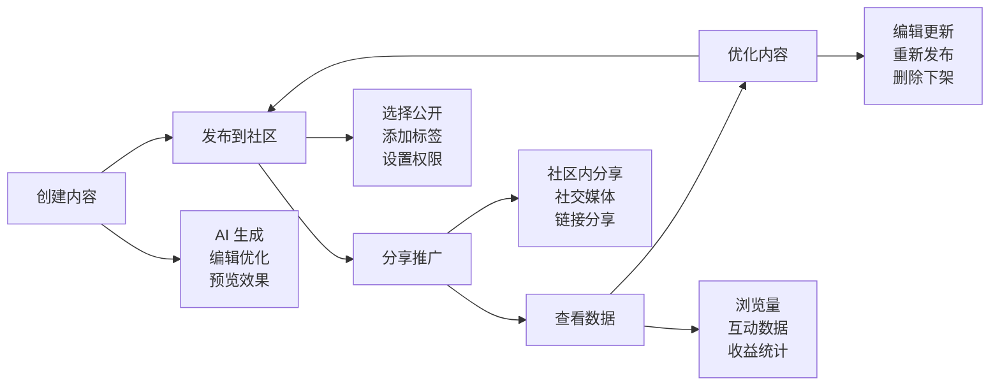
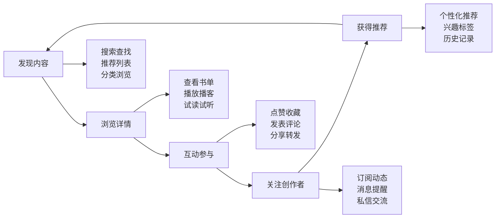
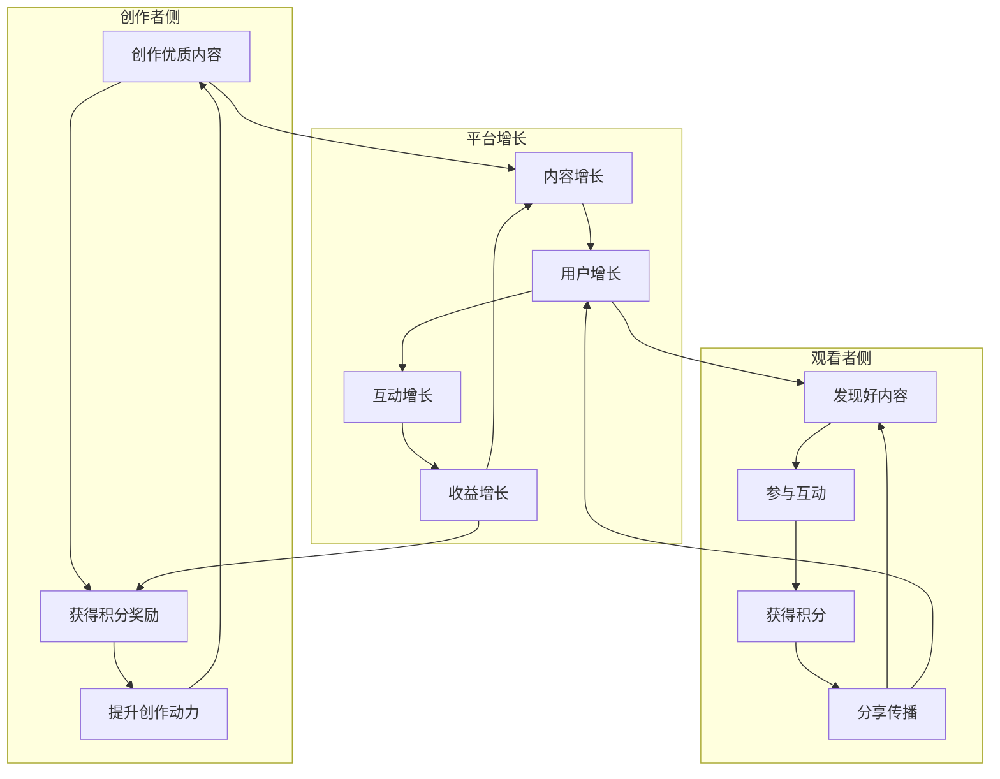

# 需求文档

## 简介

AIbrary 是一个图书阅读 AI 平台，用户可以通过 AI 创建个性化的书单和图书播客。为了促进产品增长和用户参与度，我们需要构建一个完备的 UGC（用户生成内容）社区功能。该功能将允许用户分享他们创建的内容，与其他用户互动，并通过积分激励系统鼓励社区参与。

## 用户故事地图

### 用户角色
- **内容创作者**：创建和分享书单、播客内容的用户
- **内容观看者**：浏览和消费社区内容的用户
- **社区活跃用户**：积极参与互动、评论、点赞的用户
- **平台管理员**：负责内容审核和社区管理的人员

### 用户旅程

#### 创作者旅程

#### 观看者旅程

#### 增长飞轮

## 需求

### 需求 1：内容分享功能

**用户故事：** 作为内容创作者，我希望能够将我创建的书单和播客分享到社区和外部平台，以便扩大我的内容影响力和获得更多反馈。

#### 验收标准

1. 当用户点击分享按钮时，系统应显示分享选项面板
2. 如果用户选择分享到社区，系统应将内容发布到社区公共区域
3. 如果用户选择分享到外部平台，系统应生成可分享的链接或调用相应平台的分享接口
4. 当内容被成功分享时，系统应显示成功提示并记录分享行为
5. 如果分享失败，系统应显示错误信息并允许用户重试

#### 用例场景

**场景 1：分享书单到社区**
- 前置条件：用户已创建一个包含 10 本书的"2024年必读科幻小说"书单
- 步骤：
  1. 用户在书单详情页点击"分享"按钮
  2. 选择"分享到社区"选项
  3. 添加分享说明："推荐给喜欢科幻的朋友们"
  4. 选择相关话题标签：#科幻 #2024推荐
  5. 点击"发布"
- 预期结果：书单出现在社区首页，其他用户可以发现并互动

**场景 2：生成外部分享链接**
- 前置条件：用户创建了一个"睡前故事播客"
- 步骤：
  1. 用户点击播客的"分享"按钮
  2. 选择"复制链接"
  3. 系统生成短链接：aibrary.com/p/abc123
  4. 用户将链接粘贴到微信群
- 预期结果：群友点击链接可直接访问播客，无需登录即可试听前 5 分钟

### 需求 2：积分激励系统

**用户故事：** 作为社区用户，我希望通过积极参与社区活动获得积分奖励，以便提升我在社区中的等级和获得相应权益。

#### 验收标准

1. 当用户执行分享操作时，系统应奖励相应积分
2. 当用户的内容被点赞时，系统应奖励内容创作者积分
3. 当用户的内容被评论时，系统应奖励内容创作者积分
4. 当用户评论他人内容时，系统应奖励评论者积分
5. 如果检测到恶意刷分行为，系统应暂停该用户的积分获取权限
6. 当用户查看个人中心时，系统应显示当前积分余额和积分历史记录

#### 用例场景

**场景 1：创作者获得积分奖励**
- 前置条件：用户小明发布了一个"职场必读管理书籍"书单
- 步骤：
  1. 书单发布成功，系统奖励 50 积分（发布奖励）
  2. 用户小红点赞了这个书单，小明获得 10 积分（被赞奖励）
  3. 用户小李评论"很实用的书单"，小明获得 20 积分（被评论奖励）
  4. 24小时内获得 100 个点赞，触发热门内容奖励，额外获得 200 积分
- 预期结果：小明共获得 280 积分，积分历史显示详细来源

**场景 2：防止恶意刷分**
- 前置条件：用户尝试通过自动化工具刷积分
- 步骤：
  1. 系统检测到同一 IP 在 1 分钟内点赞 50 次
  2. 触发异常行为警告
  3. 暂停该账号 24 小时的积分获取功能
  4. 发送警告通知给用户
- 预期结果：该用户在限制期内的所有操作不再获得积分

### 需求 3：社区基础互动功能

**用户故事：** 作为社区用户，我希望能够通过评论、点赞等方式与其他用户的内容进行互动，以便参与社区讨论和表达我的观点。

#### 验收标准

1. 当用户点击点赞按钮时，系统应记录点赞状态并更新点赞数
2. 如果用户已点赞，再次点击时系统应取消点赞
3. 当用户提交评论时，系统应验证评论内容的合法性
4. 如果评论内容包含敏感词，系统应拒绝发布并提示用户修改
5. 当评论发布成功时，系统应实时显示在评论列表中
6. 当用户删除自己的评论时，系统应从评论列表中移除该评论

#### 用例场景

**场景 1：用户点赞和取消点赞**
- 前置条件：用户浏览到一个感兴趣的"心理学入门"书单
- 步骤：
  1. 用户点击空心的点赞图标
  2. 图标变为实心，点赞数从 42 变为 43
  3. 用户再次点击实心图标
  4. 图标变回空心，点赞数从 43 变为 42
- 预期结果：点赞状态实时切换，数据同步更新

**场景 2：发表和回复评论**
- 前置条件：用户正在查看一个播客内容
- 步骤：
  1. 用户在评论框输入"这个播客的背景音乐很棒"
  2. 点击发送按钮
  3. 评论出现在评论列表顶部
  4. 另一用户点击该评论的"回复"
  5. 输入"同感，能分享背景音乐吗？"
  6. 回复显示在原评论下方，带有缩进
- 预期结果：评论和回复形成树形结构，支持多级对话

### 需求 4：内容搜索功能

**用户故事：** 作为社区用户，我希望能够搜索感兴趣的书单和播客内容，以便快速找到符合我需求的资源。

#### 验收标准

1. 当用户输入搜索关键词时，系统应实时显示搜索建议
2. 当用户提交搜索时，系统应返回相关的书单和播客结果
3. 如果没有匹配结果，系统应显示友好的无结果提示
4. 当用户应用筛选条件时，系统应更新搜索结果
5. 系统应支持按照相关度、时间、热度等维度对搜索结果进行排序

#### 用例场景

**场景 1：关键词搜索与智能建议**
- 前置条件：用户想找关于"时间管理"的内容
- 步骤：
  1. 用户在搜索框输入"时间"
  2. 下拉菜单显示建议："时间管理"、"时间简史"、"时间的朋友"
  3. 用户选择"时间管理"
  4. 系统显示 25 个相关书单和 8 个播客
  5. 默认按相关度排序，最相关的内容排在前面
- 预期结果：搜索结果准确，响应时间小于 1 秒

**场景 2：高级筛选搜索**
- 前置条件：用户想找最近一周内发布的投资理财书单
- 步骤：
  1. 用户搜索"投资理财"
  2. 点击"筛选"按钮
  3. 选择内容类型：仅书单
  4. 选择时间范围：最近一周
  5. 选择排序方式：最新发布
  6. 应用筛选条件
- 预期结果：只显示符合所有条件的书单，按发布时间倒序排列

### 需求 5：创作者专属功能

**用户故事：** 作为内容创作者，我希望有专门的创作者中心来管理我的内容和查看数据分析，以便优化我的创作策略。

#### 验收标准

1. 当创作者访问个人中心时，系统应显示创作者专属入口
2. 当创作者查看内容管理页面时，系统应显示所有已发布的内容列表
3. 如果创作者选择编辑内容，系统应提供内容编辑界面
4. 当创作者查看数据分析时，系统应显示内容的浏览量、点赞数、评论数等指标
5. 系统应提供内容推广工具，允许创作者主动推广自己的内容

#### 用例场景

**场景 1：查看内容数据分析**
- 前置条件：创作者发布了 5 个书单和 3 个播客
- 步骤：
  1. 创作者进入"创作者中心"
  2. 点击"数据分析"标签
  3. 选择时间范围：最近 30 天
  4. 查看总览数据：总浏览量 5.2k，总点赞 342，总评论 89
  5. 点击具体书单查看详细数据
  6. 查看用户画像：70% 为 25-35 岁职场人士
- 预期结果：数据可视化展示，支持导出 Excel 报表

**场景 2：批量管理内容**
- 前置条件：创作者想要整理过时的内容
- 步骤：
  1. 进入内容管理页面
  2. 勾选 3 个过时的书单
  3. 选择"批量操作" → "下架"
  4. 确认下架操作
  5. 这些内容从公开列表消失，但创作者仍可在"已下架"中查看
- 预期结果：批量操作成功，内容状态正确更新

### 需求 6：观看者个性化推荐

**用户故事：** 作为内容观看者，我希望系统能够根据我的兴趣推荐相关内容，以便发现更多优质的书单和播客。

#### 验收标准

1. 当用户首次进入社区时，系统应显示热门内容推荐
2. 当系统收集到用户行为数据后，应基于用户兴趣生成个性化推荐
3. 如果用户对推荐内容不感兴趣，系统应提供"不感兴趣"选项
4. 当用户选择"不感兴趣"时，系统应调整推荐算法并更新推荐内容
5. 系统应定期更新推荐内容，确保内容的新鲜度

#### 用例场景

**场景 1：新用户冷启动推荐**
- 前置条件：新注册用户首次进入社区
- 步骤：
  1. 系统展示兴趣选择页面："选择您感兴趣的类别"
  2. 用户选择：文学、历史、心理学
  3. 系统基于选择展示各类别的热门内容
  4. 首页显示 30% 文学、30% 历史、30% 心理学、10% 其他热门
- 预期结果：用户看到的内容与其选择的兴趣相关

**场景 2：基于行为的推荐优化**
- 前置条件：用户已使用产品 2 周，浏览了多个内容
- 步骤：
  1. 系统分析：用户点赞了 5 个科幻书单，评论了 3 个
  2. 用户完整听完 2 个科幻主题播客
  3. 系统提高科幻类内容的推荐权重
  4. 用户长按一个推荐的言情小说书单，选择"不感兴趣"
  5. 系统降低言情类内容的推荐权重
- 预期结果：推荐内容越来越符合用户真实兴趣

### 需求 7：内容审核机制

**用户故事：** 作为平台管理员，我希望有完善的内容审核机制，以确保社区内容的质量和合规性。

#### 验收标准

1. 当用户发布内容时，系统应自动进行初步审核
2. 如果内容包含违规信息，系统应阻止发布并提示用户
3. 当内容通过自动审核后，系统应将其标记为待人工审核状态
4. 如果内容被举报，系统应优先进行人工审核
5. 当内容审核不通过时，系统应通知创作者并说明原因

#### 用例场景

**场景 1：自动审核拦截违规内容**
- 前置条件：用户尝试发布包含敏感词的书单
- 步骤：
  1. 用户创建书单，标题包含违禁词汇
  2. 点击"发布"按钮
  3. 系统自动审核检测到违规内容
  4. 弹出提示："您的内容包含不当信息，请修改后重试"
  5. 高亮显示具体的违规部分
  6. 用户修改后重新提交
- 预期结果：违规内容被拦截，用户得到明确的修改指引

**场景 2：用户举报触发人工审核**
- 前置条件：某播客内容疑似侵权
- 步骤：
  1. 用户 A 发现播客内容可能侵权
  2. 点击"举报"按钮
  3. 选择举报原因："侵犯版权"
  4. 填写具体说明："该播客未经授权使用了 XX 的音频"
  5. 系统将该内容标记为"紧急审核"
  6. 审核员在 2 小时内处理
  7. 确认侵权后下架内容，通知双方处理结果
- 预期结果：举报得到及时处理，侵权内容被移除