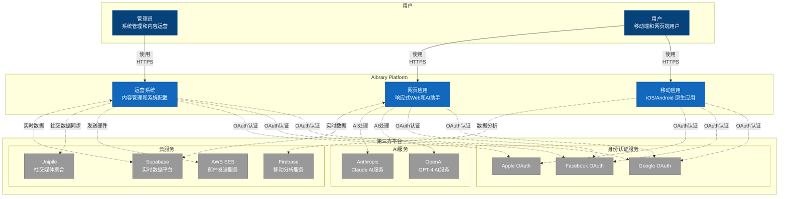
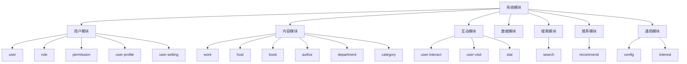
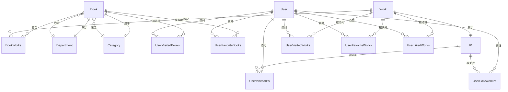
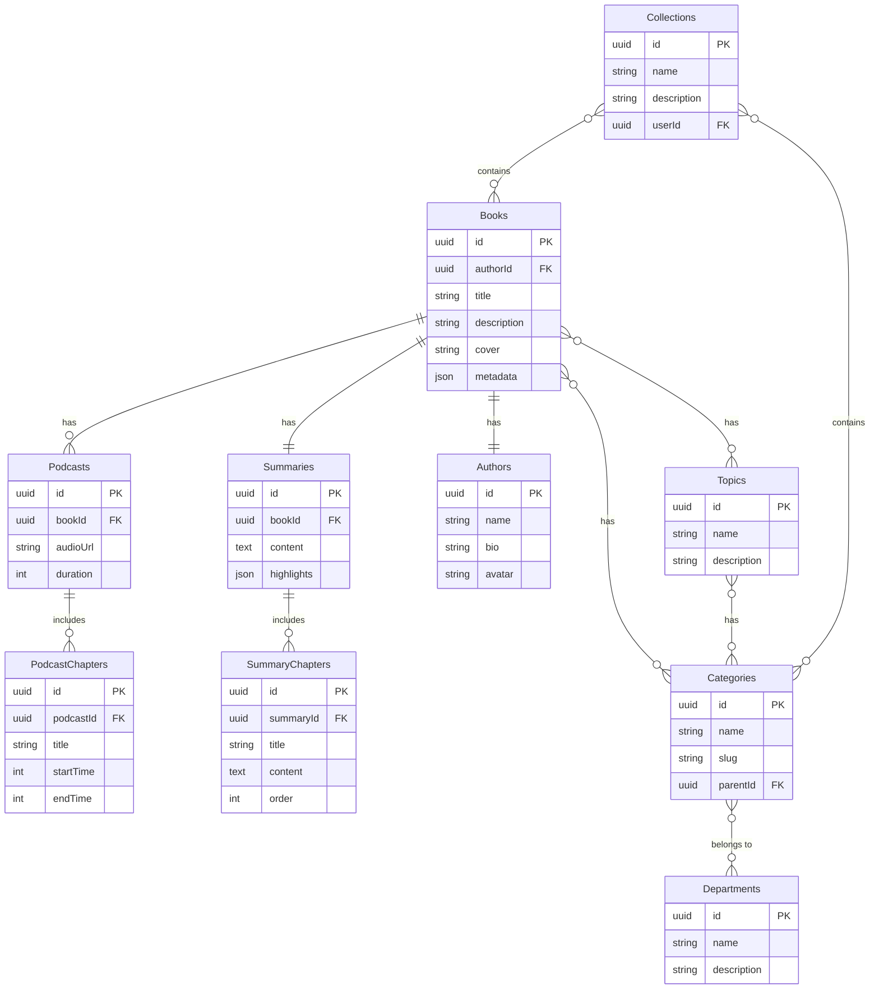
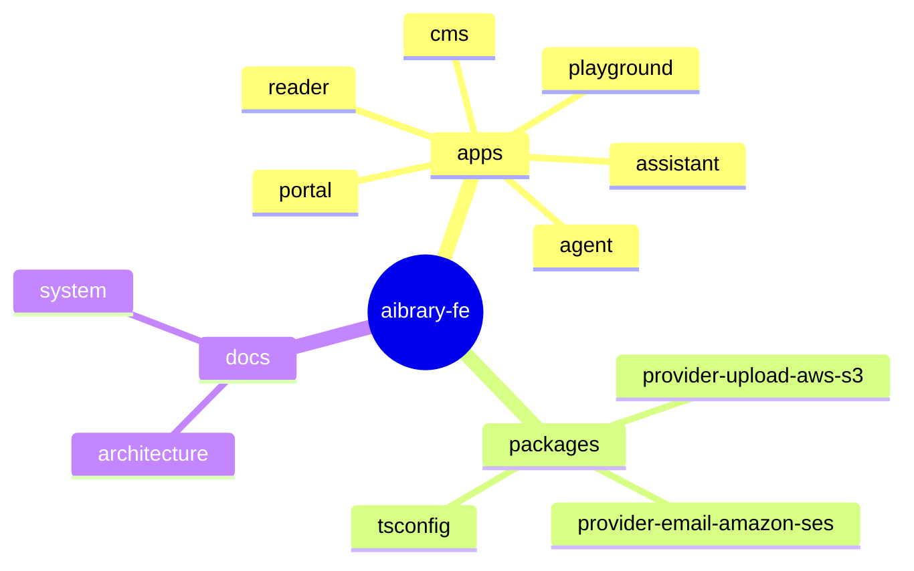

# Aibrary 系统文档

## 目录

1. [系统架构概览](#系统架构概览)
2. [系统上下文](#系统上下文)
3. [容器架构](#容器架构)
4. [技术方案](#技术方案)
5. [数据模型](#数据模型)
6. [项目结构](#项目结构)

## 系统架构概览

Aibrary 是一个基于 AI 的智能阅读平台，为用户提供书籍阅读、内容推荐、智能对话等服务。系统采用微服务架构，包含多个独立的应用和服务。

### 核心功能

- **智能阅读**：提供书籍内容的智能解析和阅读体验
- **AI 助手**：基于大语言模型的智能对话助手
- **个性化推荐**：根据用户行为和偏好提供个性化内容推荐
- **内容管理**：完整的内容创建、编辑和发布流程
- **数据分析**：实时的用户行为分析和内容效果追踪

## 系统上下文

### 架构图



### 用户角色

1. **管理员**：负责系统管理和内容运营的内部用户
2. **用户**：使用移动端和网页端的最终用户

### 核心系统

1. **Admin（运营系统）**：供管理员使用的后台管理系统，用于内容管理、用户管理和系统配置
2. **App（移动应用）**：为移动设备用户提供的原生应用，包括 iOS 和 Android 版本
3. **Web（网页应用）**：响应式网页应用，提供跨平台的访问体验

### 第三方集成

#### 身份认证服务

- **Google OAuth**：提供 Google 账号登录功能
- **Facebook OAuth**：提供 Facebook 账号登录功能
- **Apple OAuth**：提供 Apple ID 登录功能

#### 业务支撑服务

- **AI Service (OpenAI/Anthropic)**：提供 AI 处理能力，支持智能内容生成和分析
- **Email Service (AWS SES)**：处理系统邮件发送，包括通知、验证等
- **Google Analytics (Firebase)**：收集和分析移动应用使用数据，提供用户行为洞察

## 容器架构

### 架构图



```mermaid
graph TB
    %% 用户
    subgraph Users[用户]
        UA[管理员<br/>系统管理和内容运营]
        UC[用户<br/>移动端和网页端用户]
    end

    %% 应用层
    subgraph AppLayer[Aibrary Platform - 应用层]
        direction TB

        subgraph AdminSystem[管理后台]
            CMS[CMS Admin<br/>Strapi 5.15.1, TypeScript, React<br/>内容管理系统]
        end

        subgraph MobileApps[移动应用]
            iOS[iOS App<br/>Swift UI<br/>iOS原生应用]
            Android[Android App<br/>Kotlin<br/>Android原生应用]
        end

        subgraph WebApps[网页应用]
            WebPortal[Web Portal<br/>TypeScript, React, Next.js<br/>响应式网页门户]
            Assistant[AI Assistant<br/>Next.js 15.3.2, React 19<br/>智能对话助手界面]
            Reader[Reader App<br/>TypeScript, React<br/>阅读器应用]
        end
    end

    %% 服务层
    subgraph ServiceLayer[Aibrary Platform - 服务层]
        direction TB

        CMSAPI[CMS API Service<br/>Strapi 5, Node.js<br/>核心 API 服务]
        Agent[AI Agent<br/>Mastra, TypeScript<br/>AI 代理服务]
        Recommend[Recommend Service<br/>Python<br/>个性化推荐服务]
        Podcast[Podcast Service<br/>Node.js<br/>播客生成服务]

        subgraph ExtServices[扩展服务]
            Search[Search Service<br/>Golang<br/>搜索服务网关]
            Analytics[Analytics Service<br/>Supabase, PostgreSQL<br/>实时数据分析]
            Queue[Message Queue<br/>Kafka<br/>消息队列服务]
        end
    end

    %% 存储层
    subgraph StorageLayer[Aibrary Platform - 存储层]
        direction LR

        MySQL[(MySQL Database<br/>MySQL 8.0<br/>主数据库)]
        PostgreSQL[(PostgreSQL<br/>pgvector<br/>向量数据库)]
        Supabase[(Supabase<br/>PostgreSQL<br/>实时数据仓库)]
        ES[(Elasticsearch<br/>8.x<br/>全文搜索引擎)]
        Cache[(Cache<br/>Redis<br/>分布式缓存)]
        OSS[(Object Storage<br/>AWS S3<br/>媒体文件存储)]
    end

    %% 第三方服务
    subgraph ThirdParty[第三方平台]
        direction TB

        subgraph Auth[身份认证]
            GoogleAuth[Google OAuth]
            FacebookAuth[Facebook OAuth]
            AppleAuth[Apple OAuth]
        end

        subgraph BizServices[业务服务]
            OpenAI[OpenAI API]
            Anthropic[Anthropic API]
            SES[AWS SES]
            Firebase[Firebase]
            Unipile[Unipile API]
        end
    end

    %% 用户关系
    UA --> CMS
    UC --> iOS
    UC --> Android
    UC --> WebPortal
    UC --> Assistant
    UC --> Reader

    %% 应用到API的关系
    CMS --> |HTTPS/REST| CMSAPI
    iOS --> |HTTPS/REST| CMSAPI
    Android --> |HTTPS/REST| CMSAPI
    WebPortal --> |HTTPS/REST| CMSAPI
    Assistant --> |HTTPS/REST| CMSAPI
    Assistant --> |WebSocket/SSE| Agent
    Reader --> |HTTPS/REST| CMSAPI

    %% API到服务的关系
    CMSAPI --> |搜索请求| Search
    CMSAPI --> |推荐请求| Recommend
    CMSAPI --> |播客生成| Podcast
    CMSAPI --> |事件跟踪| Analytics
    CMSAPI --> |异步任务| Queue
    Agent --> |数据查询| CMSAPI
    Agent --> |语义搜索| Search
    Recommend --> |用户行为| Analytics
    Queue --> |索引更新| ES

    %% 服务到存储的关系
    CMSAPI --> |读写| MySQL
    CMSAPI --> |缓存| Cache
    CMSAPI --> |文件上传| OSS
    CMSAPI --> |内容索引| ES
    Agent --> |向量存储| PostgreSQL
    Agent --> |会话缓存| Cache
    Search --> |查询| ES
    Search --> |元数据| MySQL
    Search --> |结果缓存| Cache
    Recommend --> |模型数据| MySQL
    Analytics --> |实时同步| Supabase
    Podcast --> |内容读取| MySQL
    Podcast --> |音频存储| OSS

    %% 外部服务关系
    CMSAPI -.->|OAuth认证| GoogleAuth
    CMSAPI -.->|OAuth认证| FacebookAuth
    CMSAPI -.->|OAuth认证| AppleAuth
    iOS -.->|OAuth认证| AppleAuth
    Agent -.->|文本生成| OpenAI
    Agent -.->|对话处理| Anthropic
    Search -.->|语义搜索| OpenAI
    Podcast -.->|内容生成| OpenAI
    CMSAPI -.->|邮件发送| SES
    CMSAPI -.->|社交数据| Unipile
    iOS -.->|数据分析| Firebase
    Android -.->|数据分析| Firebase

    %% 样式定义
    classDef userStyle fill:#08427b,stroke:#024c7d,color:#fff
    classDef appStyle fill:#1168bd,stroke:#0b4884,color:#fff
    classDef serviceStyle fill:#438dd5,stroke:#2e6fb3,color:#fff
    classDef dbStyle fill:#f4f4f4,stroke:#666666,color:#000
    classDef extStyle fill:#999999,stroke:#666666,color:#fff

    class UA,UC userStyle
    class CMS,iOS,Android,WebPortal,Assistant,Reader appStyle
    class CMSAPI,Agent,Recommend,Podcast,Search,Analytics,Queue serviceStyle
    class MySQL,PostgreSQL,Supabase,ES,Cache,OSS dbStyle
    class GoogleAuth,FacebookAuth,AppleAuth,OpenAI,Anthropic,SES,Firebase,Unipile extStyle
```

### 应用层详解

#### 管理后台 (CMS Admin)

- **技术栈**：Strapi 5.15.1, TypeScript, React
- **功能**：内容管理、用户管理、系统配置、数据统计

#### 移动应用

- **iOS App**：使用 Swift UI 开发的原生应用
- **Android App**：使用 Kotlin 开发的原生应用
- **功能**：书籍阅读、个性化推荐、用户互动

#### 网页应用

- **Web Portal**：基于 Next.js 的响应式门户网站
- **AI Assistant**：智能对话助手界面，集成 Vercel AI SDK
- **Reader App**：专注的阅读体验应用

### 服务层详解

#### 核心服务

- **CMS API Service**：基于 Strapi 的核心 API 服务，提供统一的数据访问接口
- **AI Agent**：使用 Mastra 框架构建的 AI 代理服务，处理智能对话和内容理解

#### 业务服务

- **Recommend Service**：Python 实现的个性化推荐引擎
- **Podcast Service**：Node.js 实现的播客内容生成服务
- **Search Service**：Golang 实现的高性能搜索网关
- **Analytics Service**：基于 Supabase 的实时数据分析服务

#### 基础服务

- **Message Queue**：Kafka 消息队列，处理异步任务和事件流

### 存储层详解

#### 数据库

- **MySQL**：主数据库，存储核心业务数据
- **PostgreSQL + pgvector**：向量数据库，支持语义搜索
- **Supabase**：实时数据仓库，支持实时分析
- **Elasticsearch**：全文搜索引擎

#### 缓存与存储

- **Redis**：分布式缓存服务
- **AWS S3**：对象存储，用于媒体文件

## 技术方案

### 系统模块划分

整体架构包含以下七大模块：



### 模块说明

1. **用户模块**：用户管理、认证授权、用户资料、用户设置
2. **内容模块**：作品、主播、书籍、作者、分类管理
3. **互动模块**：用户互动行为、访问统计
4. **推荐模块**：个性化推荐算法实现
5. **搜索模块**：内容检索和语义搜索
6. **数据模块**：数据收集、分析、统计
7. **通用模块**：全局配置、兴趣标签管理

## 数据模型

### 核心实体关系



### 内容实体详解



## 项目结构

### Monorepo 架构



### 目录结构说明

```
aibrary-fe/
├── apps/                      # 应用程序
│   ├── cms/                   # Strapi CMS 内容管理系统
│   ├── assistant/             # AI 助手界面 (Next.js)
│   ├── agent/                 # AI 代理服务 (Mastra)
│   ├── portal/                # 门户网站
│   ├── reader/                # 阅读器应用
│   └── playground/            # 开发测试环境
├── packages/                  # 共享包
│   ├── provider-upload-aws-s3/    # S3 上传提供者
│   ├── provider-email-amazon-ses/ # SES 邮件提供者
│   └── tsconfig/                  # TypeScript 配置
├── docs/                      # 文档
│   └── system/                # 系统架构文档
├── turbo.json                 # Turborepo 配置
├── package.json               # 根包配置
└── pnpm-workspace.yaml        # pnpm 工作区配置
```

### 技术栈汇总

#### 前端技术

- **框架**：React 19, Next.js 15.3.2
- **UI 库**：Ant Design, Tailwind CSS
- **状态管理**：Zustand, React Query
- **AI SDK**：Vercel AI SDK, Mastra

#### 后端技术

- **CMS**：Strapi 5.15.1
- **语言**：TypeScript, JavaScript, Python, Golang
- **数据库**：MySQL 8.0, PostgreSQL, Redis
- **搜索**：Elasticsearch 8.x
- **消息队列**：Kafka

#### 基础设施

- **容器**：Docker, Kubernetes
- **云服务**：AWS (S3, SES, ElastiCache)
- **监控**：OpenTelemetry
- **CI/CD**：GitHub Actions

#### 开发工具

- **包管理**：pnpm
- **构建工具**：Turborepo
- **代码质量**：Biome, ESLint, Prettier
- **Git 工作流**：Husky, lint-staged, commitlint

## 部署架构

### 容器化部署

各应用均提供 Docker 支持：

- `apps/cms/Dockerfile.turborepo`：CMS 容器
- `apps/assistant/Dockerfile`：助手界面容器
- `apps/agent/Dockerfile`：AI 代理服务容器

### 环境配置

- 生产环境：`.env.production`
- 开发环境：各应用独立配置
- 环境变量管理：通过 Kubernetes ConfigMap 或云平台配置服务

### 扩展性设计

- **水平扩展**：无状态服务设计，支持多实例部署
- **负载均衡**：通过 Kubernetes Service 或云负载均衡器
- **缓存策略**：多级缓存，包括 CDN、Redis、应用级缓存
- **数据分片**：数据库读写分离，支持分库分表

## 安全架构

### 认证与授权

- OAuth 2.0 社交登录集成
- JWT Token 认证机制
- 基于角色的访问控制 (RBAC)

### 数据安全

- HTTPS 加密传输
- 敏感数据加密存储
- API 访问速率限制
- SQL 注入和 XSS 防护

### 监控与审计

- 操作日志记录
- 异常监控告警
- 性能指标追踪
- 安全事件审计
